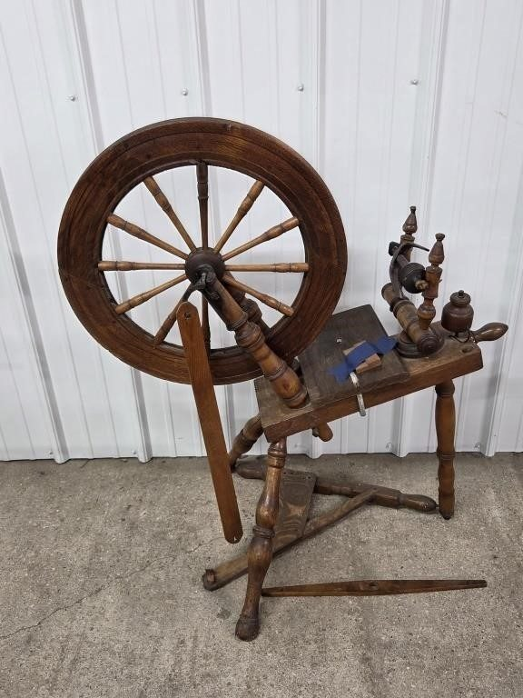
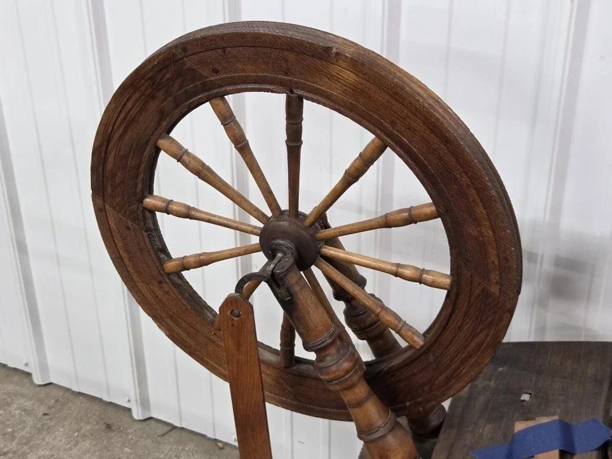
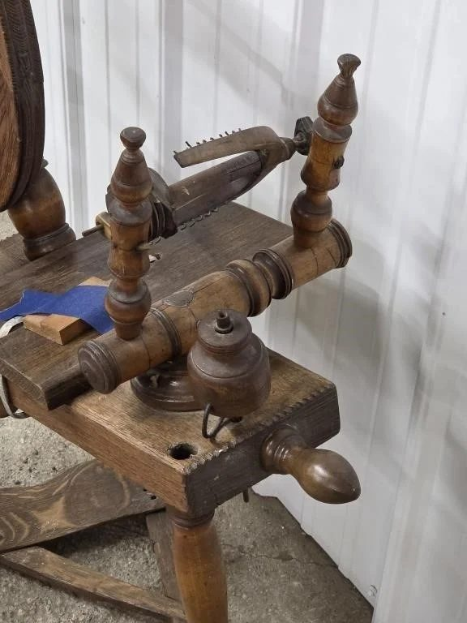
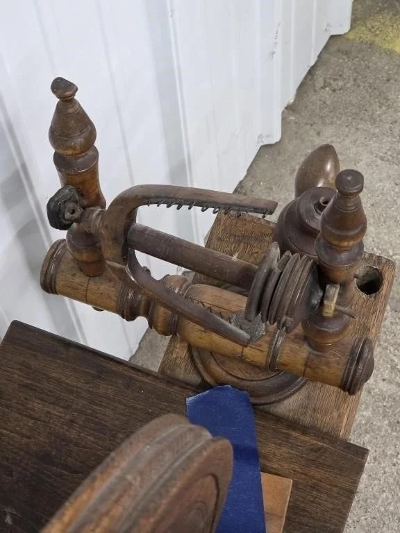
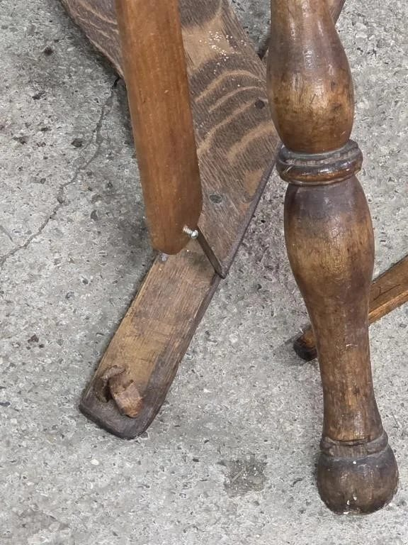
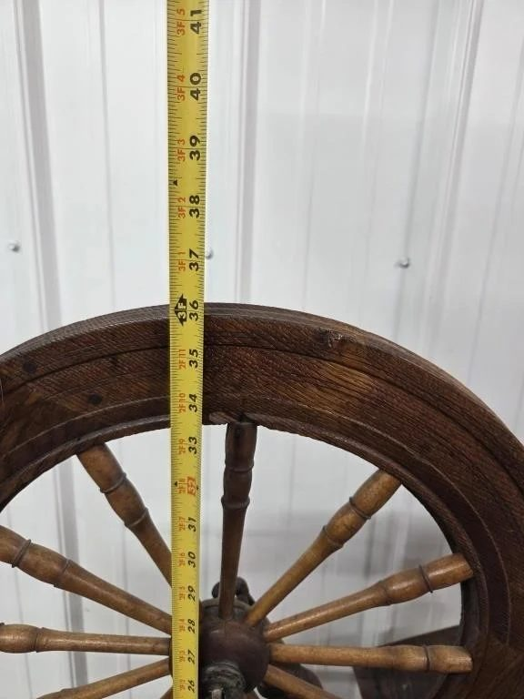
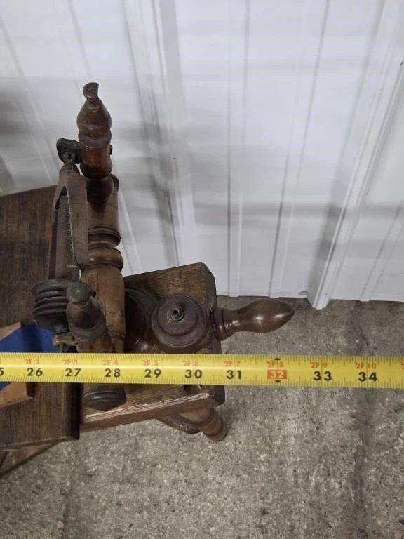

# Lot 100

New England Spinning Wheel 1800s

- Snapshot bid: 7.0
- Price realized: 0
- Bid count: 5
- Mirrored photos: 7
- HiBid page: https://hibid.com/lot/321408213

## Photo 1

[Original HiBid image](https://cdn.hibid.com/img.axd?id=8425350936&wid=&rwl=false&p=&ext=&w=0&h=0&t=&lp=&c=true&wt=false&sz=MAX&checksum=j7qZTpA5Q9pyzTXvd8WYtUVrJ%2b1NdH1O)

## Photo 2

[Original HiBid image](https://cdn.hibid.com/img.axd?id=8425350919&wid=&rwl=false&p=&ext=&w=0&h=0&t=&lp=&c=true&wt=false&sz=MAX&checksum=j7qZTpA5Q9ppGbZRC6v1i8e2gl4oLWiF)

## Photo 3

[Original HiBid image](https://cdn.hibid.com/img.axd?id=8425350935&wid=&rwl=false&p=&ext=&w=0&h=0&t=&lp=&c=true&wt=false&sz=MAX&checksum=j7qZTpA5Q9qZ8V6G%2b8dMfEIVvh3JNihU)

## Photo 4

[Original HiBid image](https://cdn.hibid.com/img.axd?id=8425350920&wid=&rwl=false&p=&ext=&w=0&h=0&t=&lp=&c=true&wt=false&sz=MAX&checksum=j7qZTpA5Q9q6pXmDI2ZTKRjPn5KYGp7u)

## Photo 5

[Original HiBid image](https://cdn.hibid.com/img.axd?id=8425350929&wid=&rwl=false&p=&ext=&w=0&h=0&t=&lp=&c=true&wt=false&sz=MAX&checksum=j7qZTpA5Q9rfVkRgMeyjPMI0ROKcqwZD)

## Photo 6

[Original HiBid image](https://cdn.hibid.com/img.axd?id=8425350901&wid=&rwl=false&p=&ext=&w=0&h=0&t=&lp=&c=true&wt=false&sz=MAX&checksum=j7qZTpA5Q9qhrgXokVPW1AdDOt44PFxZ)

## Photo 7

[Original HiBid image](https://cdn.hibid.com/img.axd?id=8425350928&wid=&rwl=false&p=&ext=&w=0&h=0&t=&lp=&c=true&wt=false&sz=MAX&checksum=j7qZTpA5Q9o2tNgX8CSBUacyPJa8pZzH)
