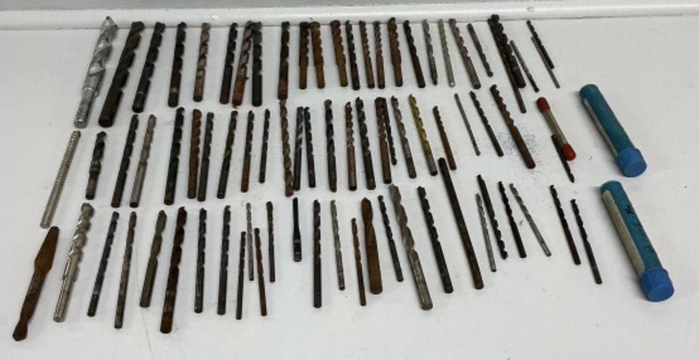
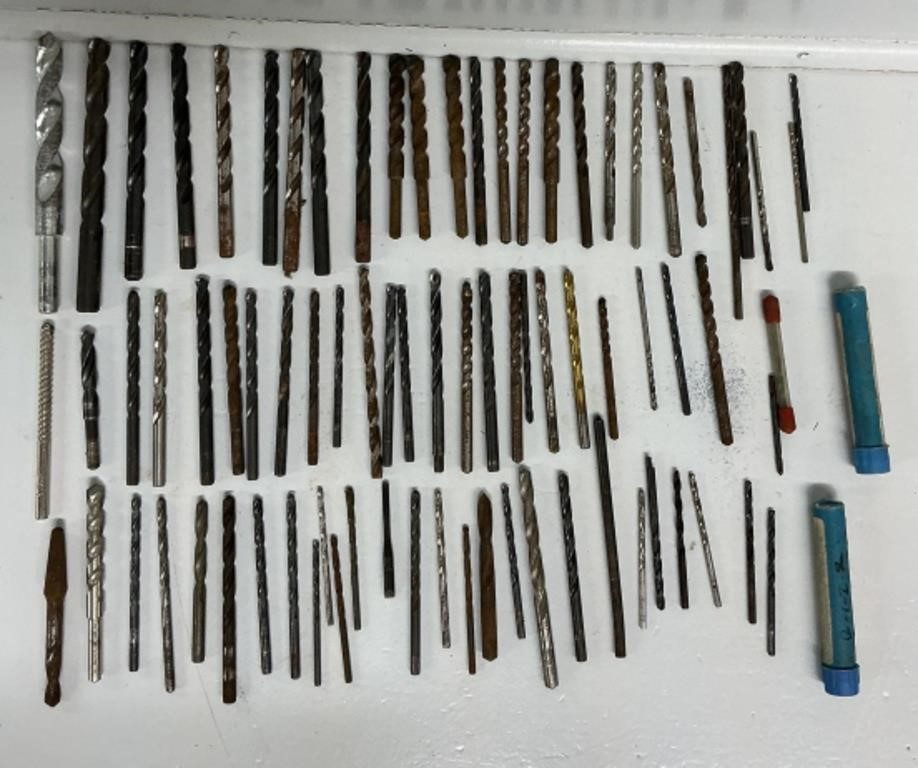
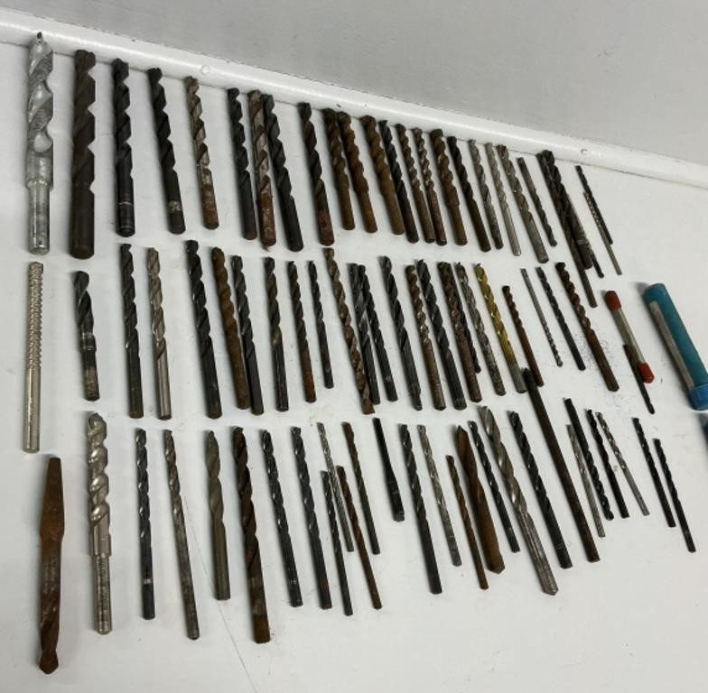
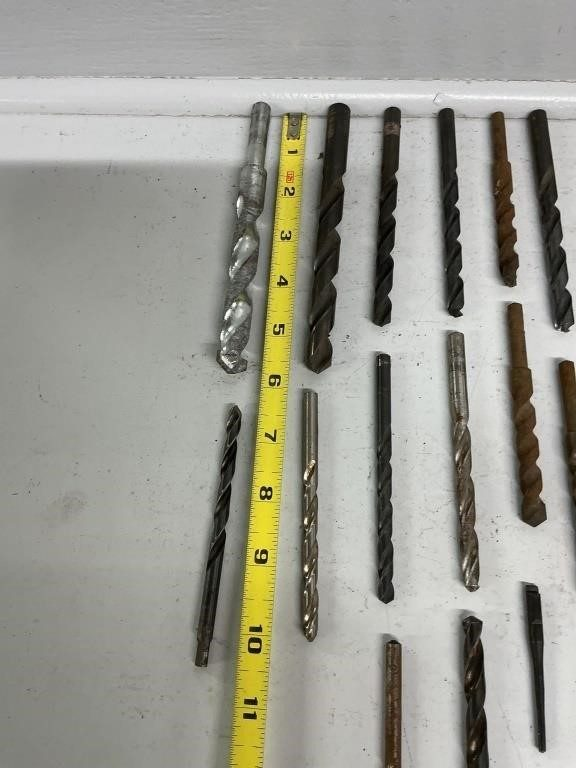
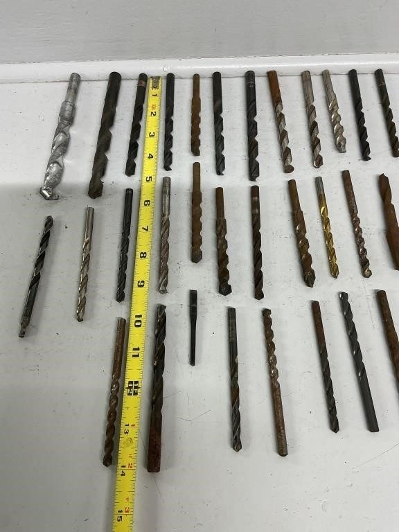
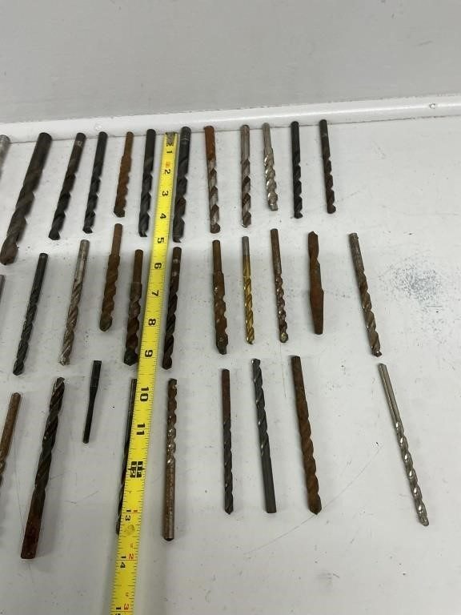
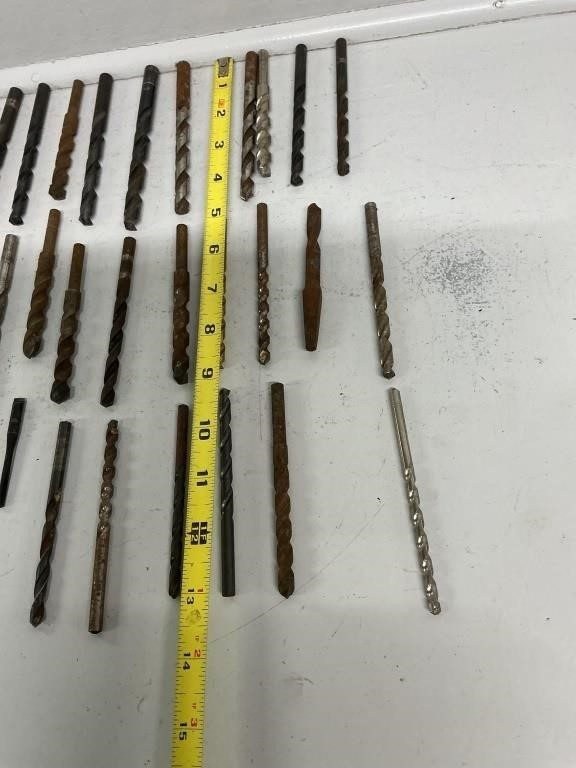
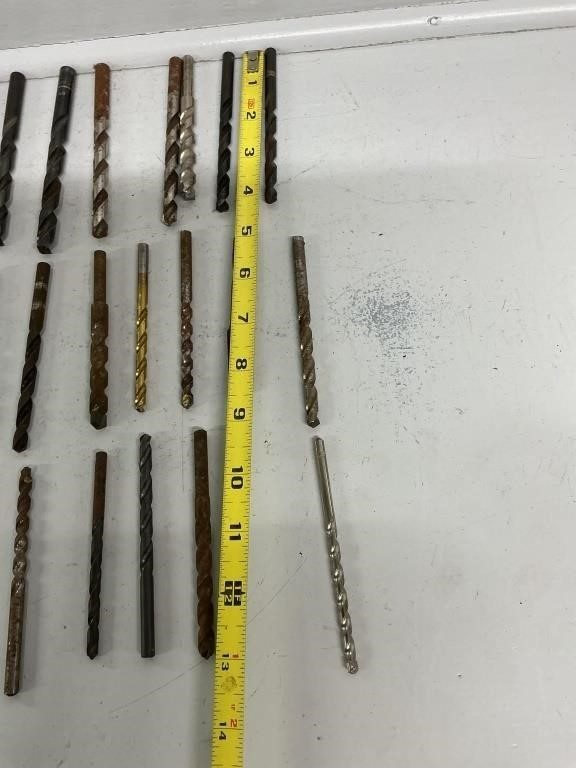

# Lot 296

Wood Auger Bits Assorted Sizes

- Snapshot bid: 2.0
- Price realized: 0
- Bid count: 1
- Mirrored photos: 8
- HiBid page: https://hibid.com/lot/321408570

## Photo 1

[Original HiBid image](https://cdn.hibid.com/img.axd?id=8425358283&wid=&rwl=false&p=&ext=&w=0&h=0&t=&lp=&c=true&wt=false&sz=MAX&checksum=k5iPj9n0Bn4DgsBBg2sMhDDtOMH1B0%2fJ)

## Photo 2

[Original HiBid image](https://cdn.hibid.com/img.axd?id=8425358286&wid=&rwl=false&p=&ext=&w=0&h=0&t=&lp=&c=true&wt=false&sz=MAX&checksum=k5iPj9n0Bn4XP7Nv%2b0k0c1%2bfEy6AeH1T)

## Photo 3

[Original HiBid image](https://cdn.hibid.com/img.axd?id=8425358298&wid=&rwl=false&p=&ext=&w=0&h=0&t=&lp=&c=true&wt=false&sz=MAX&checksum=k5iPj9n0Bn4wwLqRNZp8%2bGwE0TGKP1vI)

## Photo 4

[Original HiBid image](https://cdn.hibid.com/img.axd?id=8425358291&wid=&rwl=false&p=&ext=&w=0&h=0&t=&lp=&c=true&wt=false&sz=MAX&checksum=k5iPj9n0Bn4huLEBJ3BEekzteqNQt7aI)

## Photo 5

[Original HiBid image](https://cdn.hibid.com/img.axd?id=8425358290&wid=&rwl=false&p=&ext=&w=0&h=0&t=&lp=&c=true&wt=false&sz=MAX&checksum=k5iPj9n0Bn5f0V1pv5n8WgULvwzlw6Pv)

## Photo 6

[Original HiBid image](https://cdn.hibid.com/img.axd?id=8425358297&wid=&rwl=false&p=&ext=&w=0&h=0&t=&lp=&c=true&wt=false&sz=MAX&checksum=k5iPj9n0Bn6Mh%2bcS7wJME8Isvr2iP1N1)

## Photo 7

[Original HiBid image](https://cdn.hibid.com/img.axd?id=8425358301&wid=&rwl=false&p=&ext=&w=0&h=0&t=&lp=&c=true&wt=false&sz=MAX&checksum=L0naqjmOJM%2fXvSln3lsavE5wljPoveo9)

## Photo 8

[Original HiBid image](https://cdn.hibid.com/img.axd?id=8425358277&wid=&rwl=false&p=&ext=&w=0&h=0&t=&lp=&c=true&wt=false&sz=MAX&checksum=k5iPj9n0Bn4weu8A0r6PDCjrDirp35XM)
