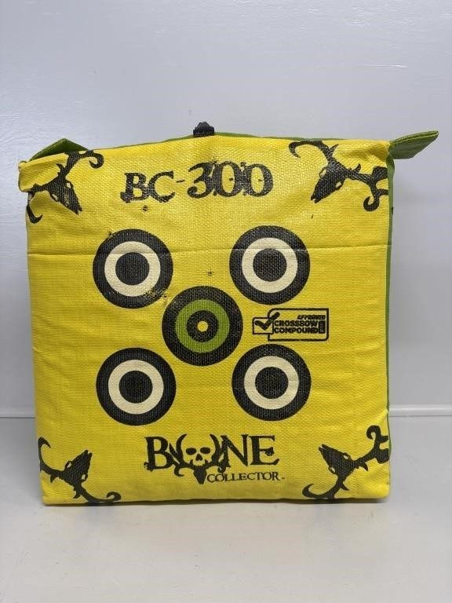
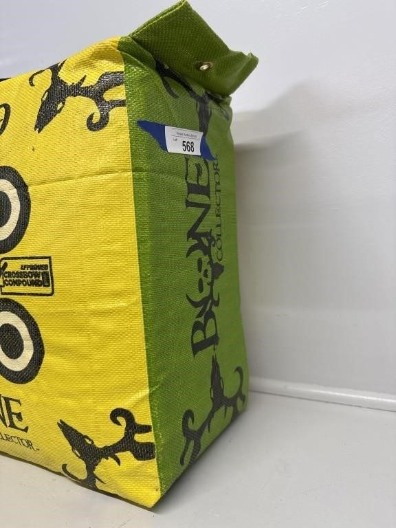
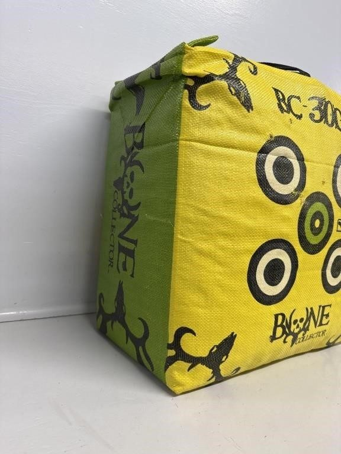
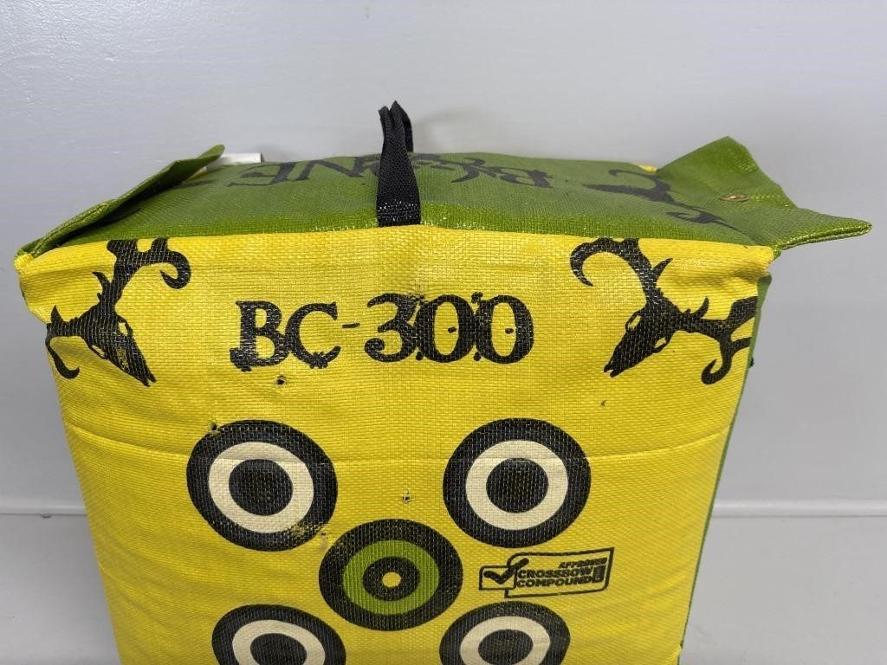
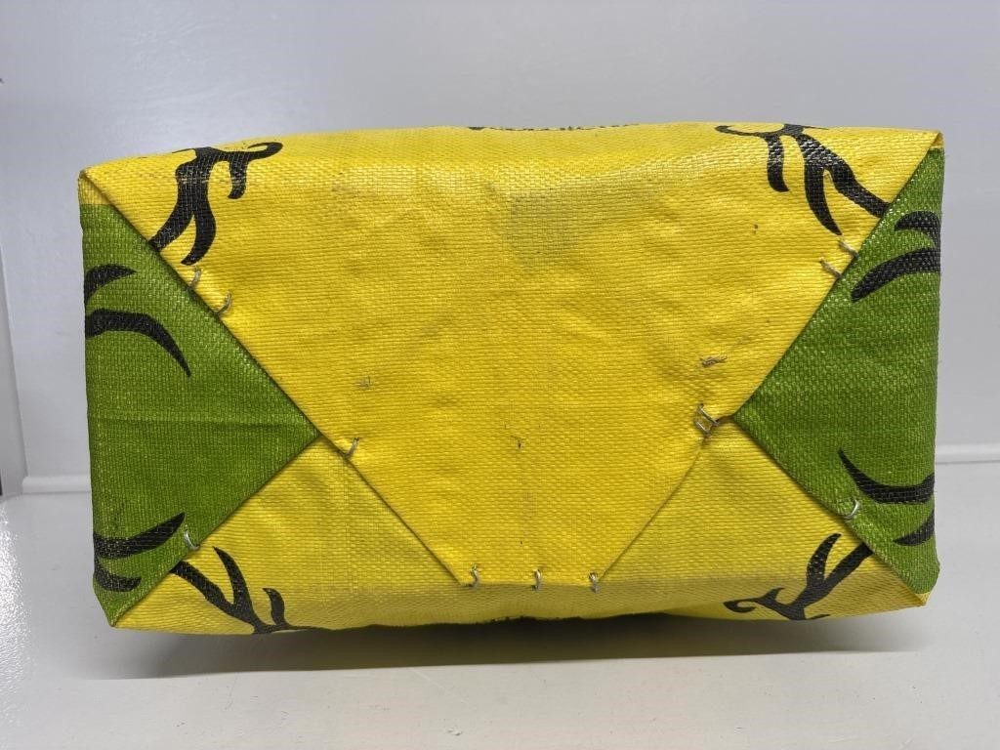
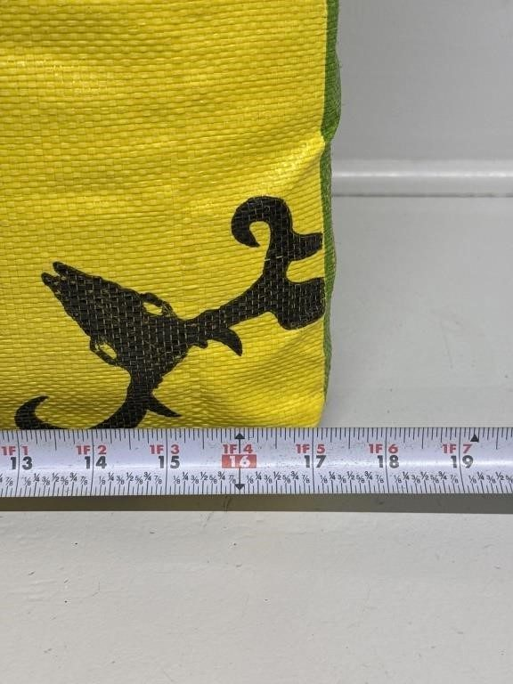
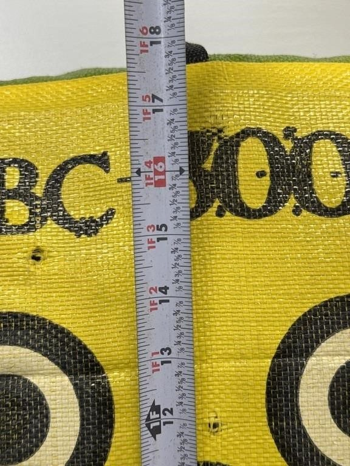
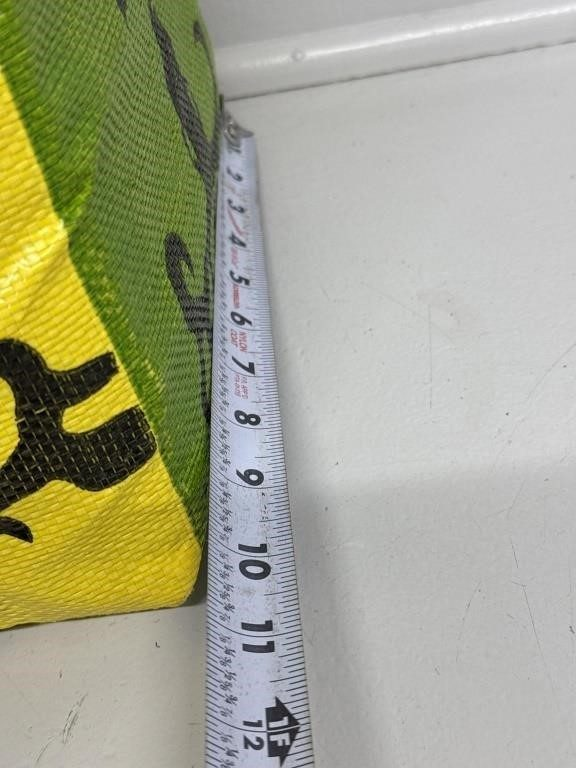

# Lot 568

Bone Collector 300 Bag Field Point Archery Target

- Snapshot bid: 12.0
- Price realized: 0
- Bid count: 11
- Mirrored photos: 8
- HiBid page: https://hibid.com/lot/321408923

## Photo 1

[Original HiBid image](https://cdn.hibid.com/img.axd?id=8425367181&wid=&rwl=false&p=&ext=&w=0&h=0&t=&lp=&c=true&wt=false&sz=MAX&checksum=2UjV%2fTNbh0qzZmf9M0hRbdGu4sYDKPFl)

## Photo 2

[Original HiBid image](https://cdn.hibid.com/img.axd?id=8425367186&wid=&rwl=false&p=&ext=&w=0&h=0&t=&lp=&c=true&wt=false&sz=MAX&checksum=2UjV%2fTNbh0q0xd9LB061AOMHSsZRUbUI)

## Photo 3

[Original HiBid image](https://cdn.hibid.com/img.axd?id=8425367204&wid=&rwl=false&p=&ext=&w=0&h=0&t=&lp=&c=true&wt=false&sz=MAX&checksum=vFEszJM9e04r1jqM%2fXSpmzpPfzrSwwKR)

## Photo 4

[Original HiBid image](https://cdn.hibid.com/img.axd?id=8425367207&wid=&rwl=false&p=&ext=&w=0&h=0&t=&lp=&c=true&wt=false&sz=MAX&checksum=vFEszJM9e05rikB9LbcvEay8YX478lms)

## Photo 5

[Original HiBid image](https://cdn.hibid.com/img.axd?id=8425367205&wid=&rwl=false&p=&ext=&w=0&h=0&t=&lp=&c=true&wt=false&sz=MAX&checksum=vFEszJM9e04R3VYyNozWbJQPKGvprrGs)

## Photo 6

[Original HiBid image](https://cdn.hibid.com/img.axd?id=8425367221&wid=&rwl=false&p=&ext=&w=0&h=0&t=&lp=&c=true&wt=false&sz=MAX&checksum=vFEszJM9e05zsVflIZ0hmd1V3uEFo4LS)

## Photo 7

[Original HiBid image](https://cdn.hibid.com/img.axd?id=8425367212&wid=&rwl=false&p=&ext=&w=0&h=0&t=&lp=&c=true&wt=false&sz=MAX&checksum=vFEszJM9e05qg%2bHJYyOPmtncZ%2bluafJp)

## Photo 8

[Original HiBid image](https://cdn.hibid.com/img.axd?id=8425367216&wid=&rwl=false&p=&ext=&w=0&h=0&t=&lp=&c=true&wt=false&sz=MAX&checksum=vFEszJM9e06s2eqHF1dKbSed%2bIx%2b8TFM)
