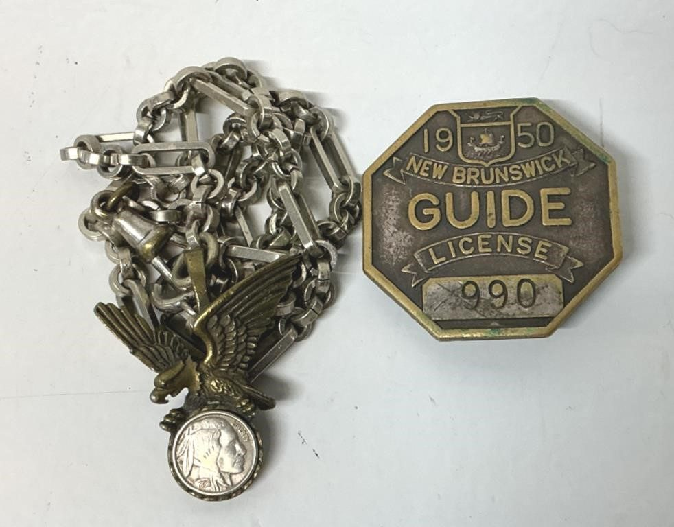
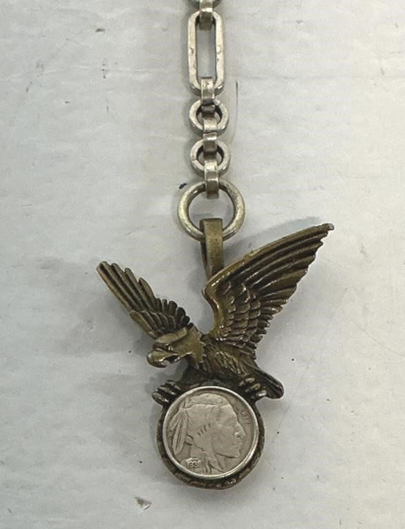
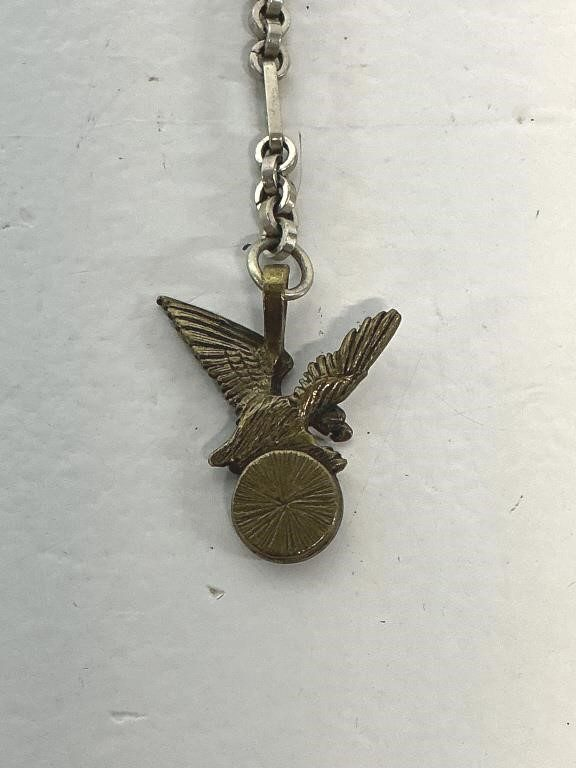
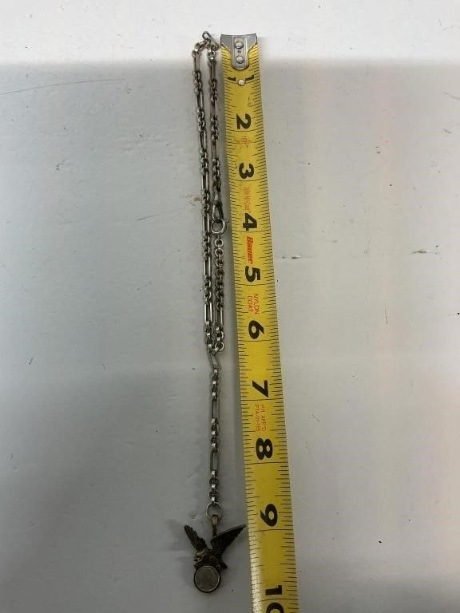
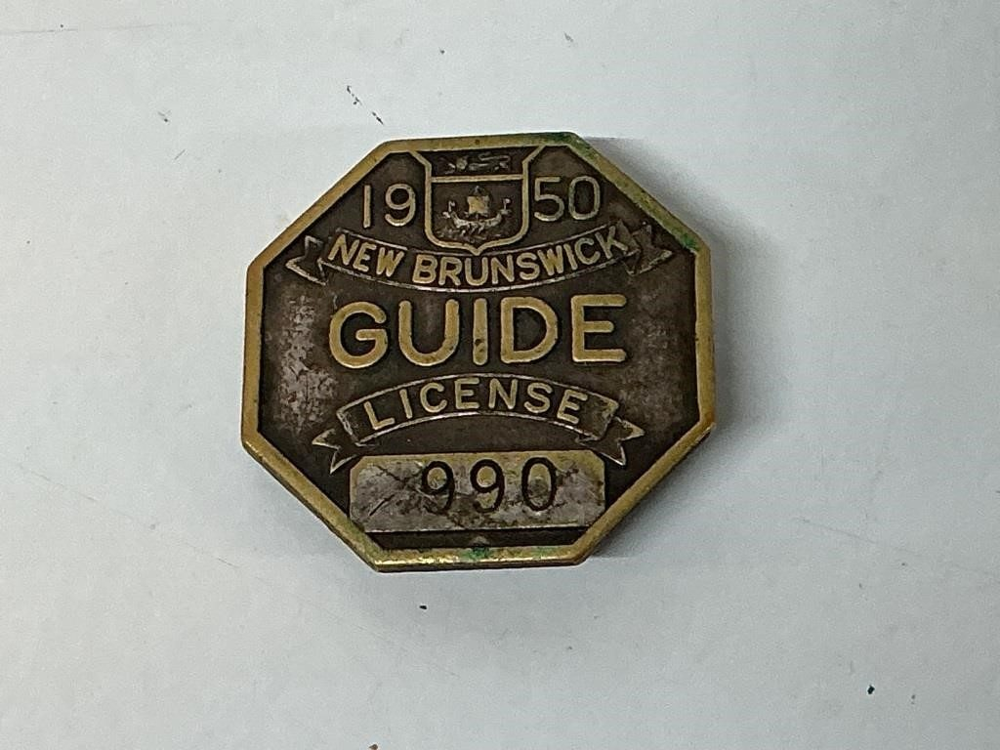
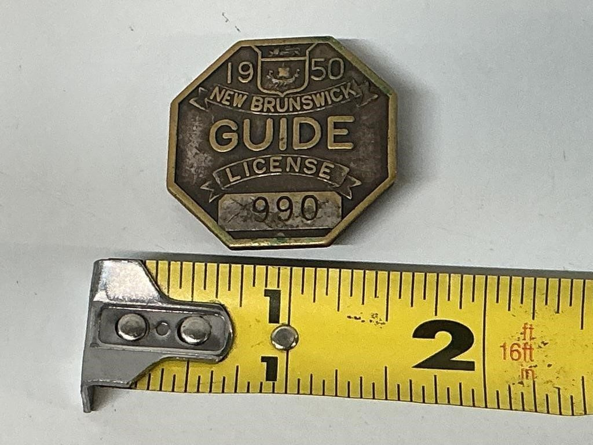

# Lot 605

1950 New Brunswick Guide License Badge, Eagle

- Snapshot bid: 6.0
- Price realized: 0
- Bid count: 4
- Mirrored photos: 6
- HiBid page: https://hibid.com/lot/321408964

## Photo 1

[Original HiBid image](https://cdn.hibid.com/img.axd?id=8425368571&wid=&rwl=false&p=&ext=&w=0&h=0&t=&lp=&c=true&wt=false&sz=MAX&checksum=Is5sRHA2MW3MoGC4aPugLdJy8n7Z%2b5f7)

## Photo 2

[Original HiBid image](https://cdn.hibid.com/img.axd?id=8425368577&wid=&rwl=false&p=&ext=&w=0&h=0&t=&lp=&c=true&wt=false&sz=MAX&checksum=Is5sRHA2MW203rC6DOhK1VMtnZMBAXls)

## Photo 3

[Original HiBid image](https://cdn.hibid.com/img.axd?id=8425368560&wid=&rwl=false&p=&ext=&w=0&h=0&t=&lp=&c=true&wt=false&sz=MAX&checksum=Is5sRHA2MW1jHpw9qawHPgl0bz66qU%2fk)

## Photo 4

[Original HiBid image](https://cdn.hibid.com/img.axd?id=8425368581&wid=&rwl=false&p=&ext=&w=0&h=0&t=&lp=&c=true&wt=false&sz=MAX&checksum=Is5sRHA2MW2gk2WaU0sE9h0yKBlQRdKn)

## Photo 5

[Original HiBid image](https://cdn.hibid.com/img.axd?id=8425368608&wid=&rwl=false&p=&ext=&w=0&h=0&t=&lp=&c=true&wt=false&sz=MAX&checksum=p7B0F%2bLoinJPw2TFUr6YxjkMvph2GvPn)

## Photo 6

[Original HiBid image](https://cdn.hibid.com/img.axd?id=8425368596&wid=&rwl=false&p=&ext=&w=0&h=0&t=&lp=&c=true&wt=false&sz=MAX&checksum=Is5sRHA2MW3QtYK3EGRJYH41jacjy8i5)
