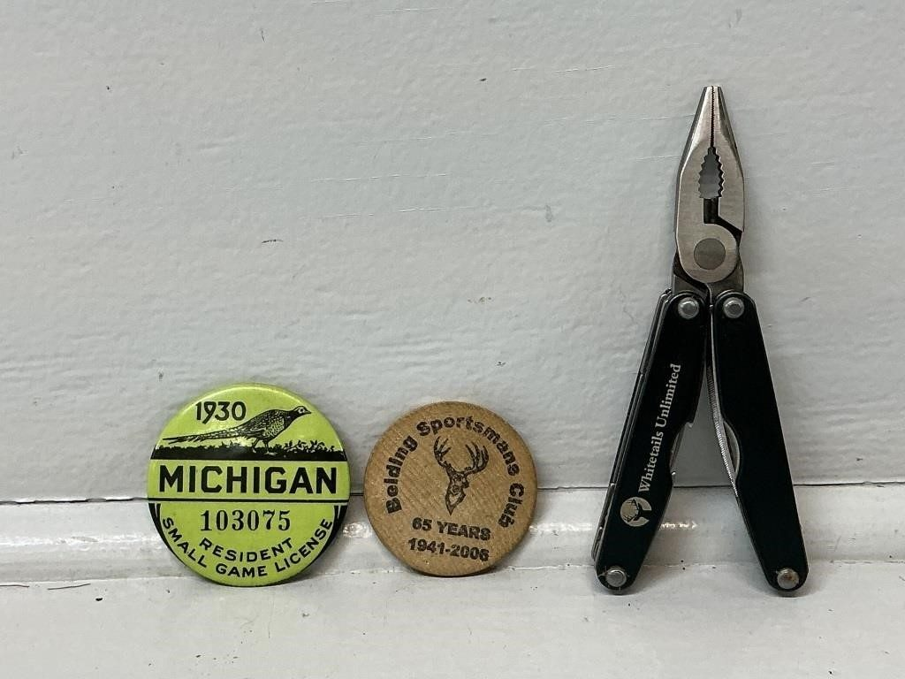
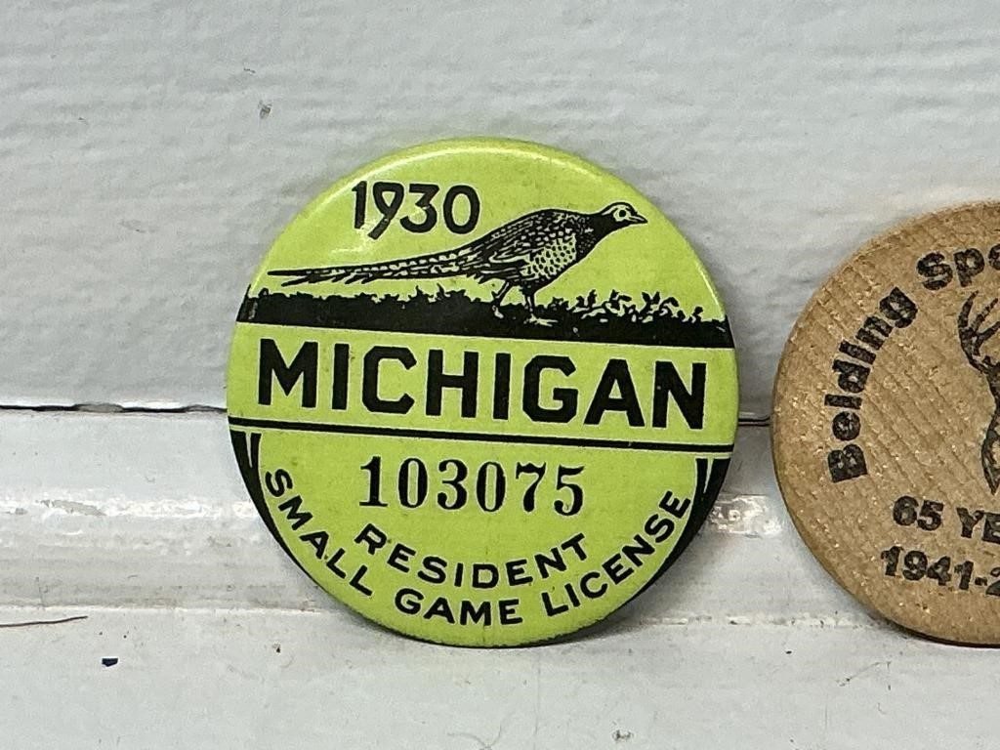
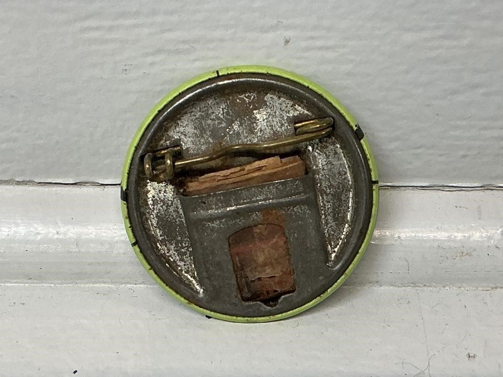
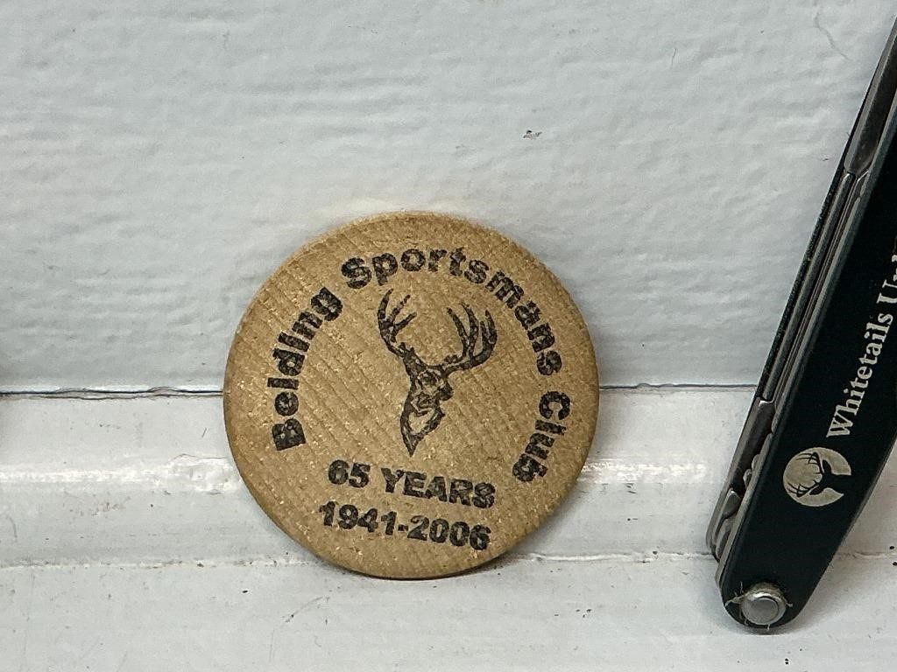
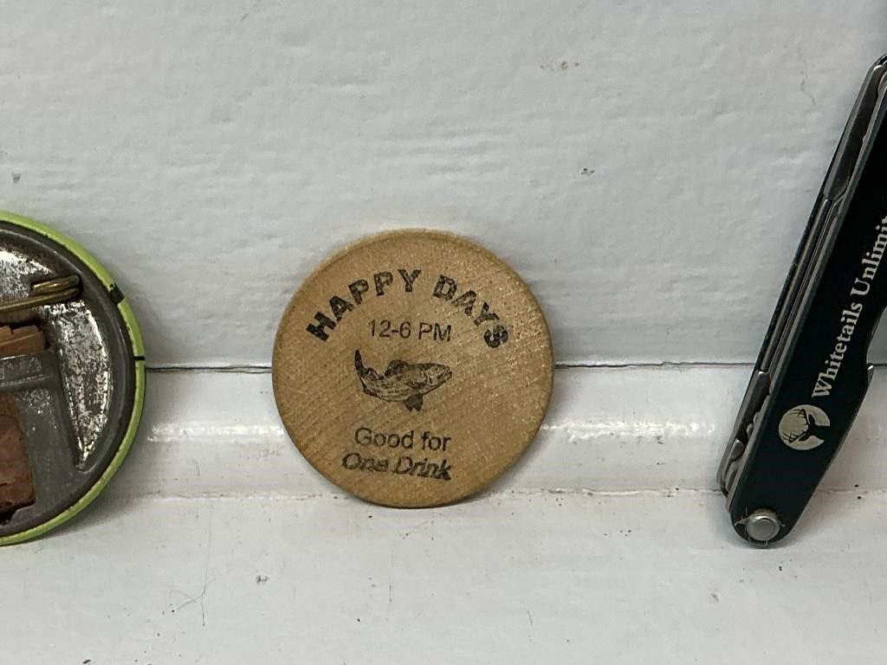
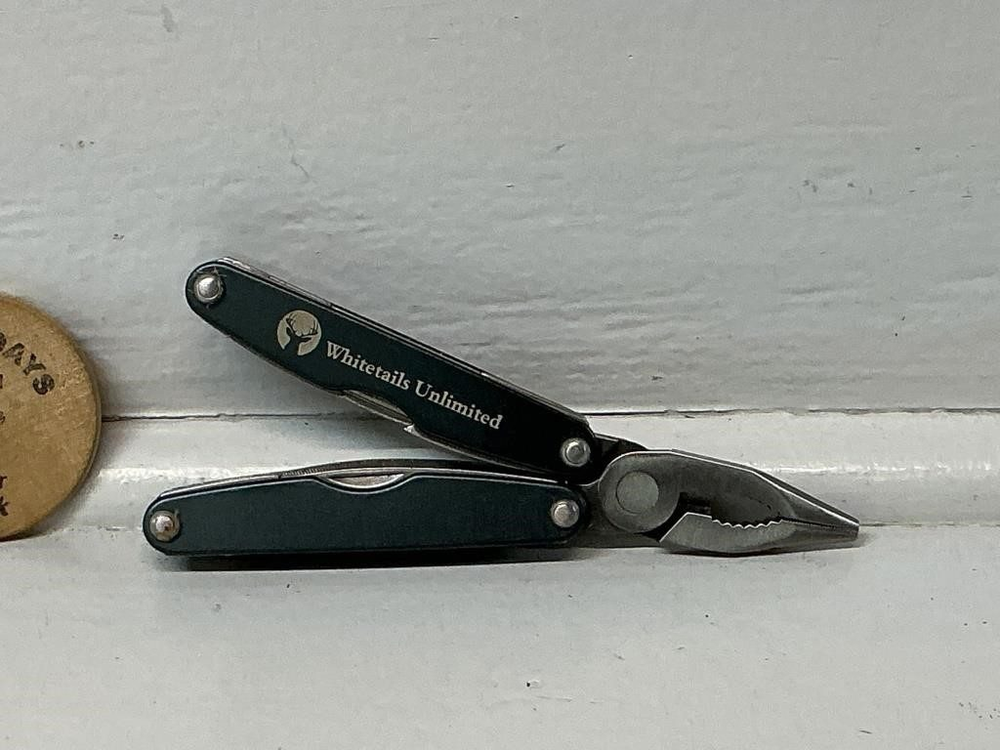
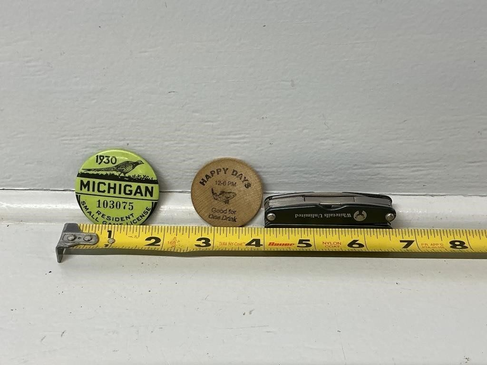

# Lot 624

1930 Michigan Resident Small Game Hunting

- Snapshot bid: 8.0
- Price realized: 0
- Bid count: 6
- Mirrored photos: 7
- HiBid page: https://hibid.com/lot/321408973

## Photo 1

[Original HiBid image](https://cdn.hibid.com/img.axd?id=8425368803&wid=&rwl=false&p=&ext=&w=0&h=0&t=&lp=&c=true&wt=false&sz=MAX&checksum=fnzbwjyBMyvVnokll%2fPtCoCGGWBWD2y9)

## Photo 2

[Original HiBid image](https://cdn.hibid.com/img.axd?id=8425368805&wid=&rwl=false&p=&ext=&w=0&h=0&t=&lp=&c=true&wt=false&sz=MAX&checksum=fnzbwjyBMyvCsmCqUhFmgVkDrHcs8hlU)

## Photo 3

[Original HiBid image](https://cdn.hibid.com/img.axd?id=8425368824&wid=&rwl=false&p=&ext=&w=0&h=0&t=&lp=&c=true&wt=false&sz=MAX&checksum=fnzbwjyBMyvi9FdLttZe1EsDziYt5%2brQ)

## Photo 4

[Original HiBid image](https://cdn.hibid.com/img.axd?id=8425368829&wid=&rwl=false&p=&ext=&w=0&h=0&t=&lp=&c=true&wt=false&sz=MAX&checksum=fnzbwjyBMyuSXO8fsTAAMmYAYK128Kbh)

## Photo 5

[Original HiBid image](https://cdn.hibid.com/img.axd?id=8425368843&wid=&rwl=false&p=&ext=&w=0&h=0&t=&lp=&c=true&wt=false&sz=MAX&checksum=fnzbwjyBMytMMYk1MXBXWc8A4%2fDfK5dy)

## Photo 6

[Original HiBid image](https://cdn.hibid.com/img.axd?id=8425368825&wid=&rwl=false&p=&ext=&w=0&h=0&t=&lp=&c=true&wt=false&sz=MAX&checksum=fnzbwjyBMyvDuRxyxMmDM5cFFD1DMidS)

## Photo 7

[Original HiBid image](https://cdn.hibid.com/img.axd?id=8425368837&wid=&rwl=false&p=&ext=&w=0&h=0&t=&lp=&c=true&wt=false&sz=MAX&checksum=fnzbwjyBMyvtyh%2fvFRbFfnHZuBaEclbr)
