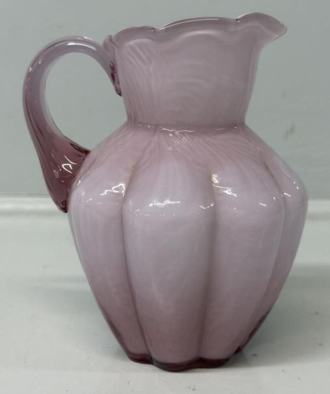
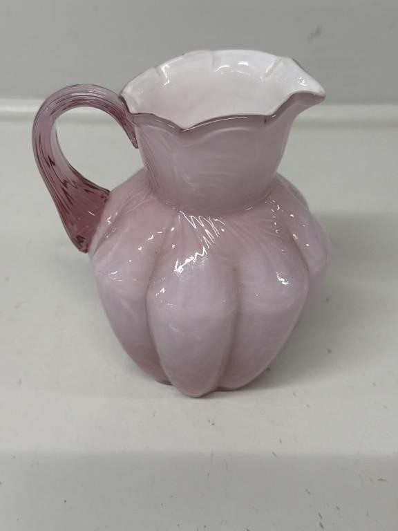
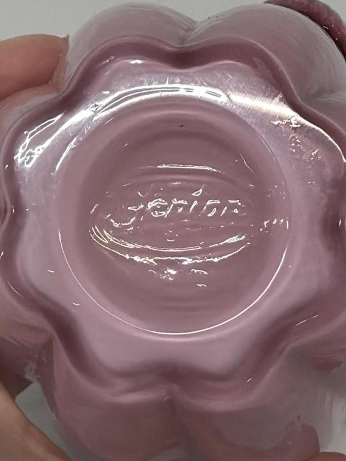
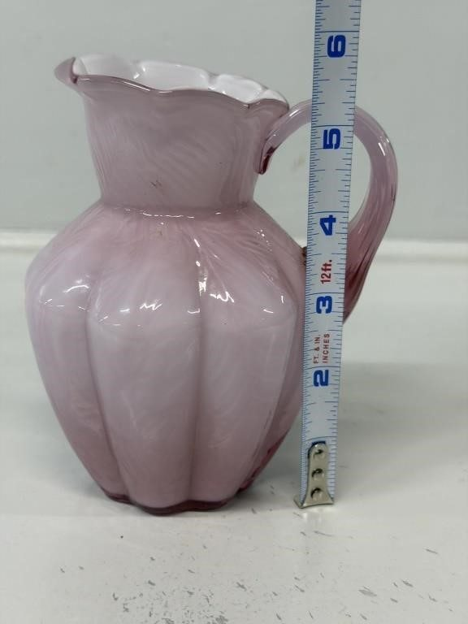
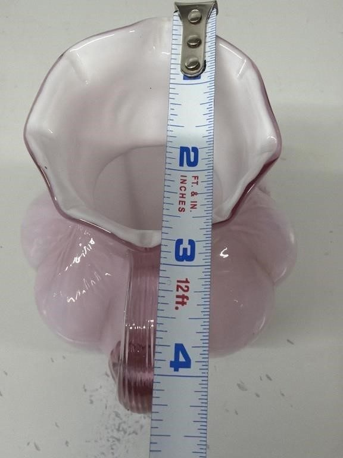

# Lot 652

Fenton Rose Overlay Melon Shaped Small Pitcher

- Snapshot bid: 13.0
- Price realized: 0
- Bid count: 11
- Mirrored photos: 5
- HiBid page: https://hibid.com/lot/321408996

## Photo 1

[Original HiBid image](https://cdn.hibid.com/img.axd?id=8425369619&wid=&rwl=false&p=&ext=&w=0&h=0&t=&lp=&c=true&wt=false&sz=MAX&checksum=6h4clfZGDHCS%2bfi6rqo6mvnie7C8kA%2fS)

## Photo 2

[Original HiBid image](https://cdn.hibid.com/img.axd?id=8425369617&wid=&rwl=false&p=&ext=&w=0&h=0&t=&lp=&c=true&wt=false&sz=MAX&checksum=6h4clfZGDHAbFY5u3cJAGsVz5sViZeIA)

## Photo 3

[Original HiBid image](https://cdn.hibid.com/img.axd?id=8425369628&wid=&rwl=false&p=&ext=&w=0&h=0&t=&lp=&c=true&wt=false&sz=MAX&checksum=6h4clfZGDHCvFBwKv8E4Qi7zQmQh639s)

## Photo 4

[Original HiBid image](https://cdn.hibid.com/img.axd?id=8425369638&wid=&rwl=false&p=&ext=&w=0&h=0&t=&lp=&c=true&wt=false&sz=MAX&checksum=6h4clfZGDHBvdpRVCLDcnHjMD1VLpI9C)

## Photo 5

[Original HiBid image](https://cdn.hibid.com/img.axd?id=8425369640&wid=&rwl=false&p=&ext=&w=0&h=0&t=&lp=&c=true&wt=false&sz=MAX&checksum=6h4clfZGDHDWZzPmzii0rvlUAt89pu6S)
