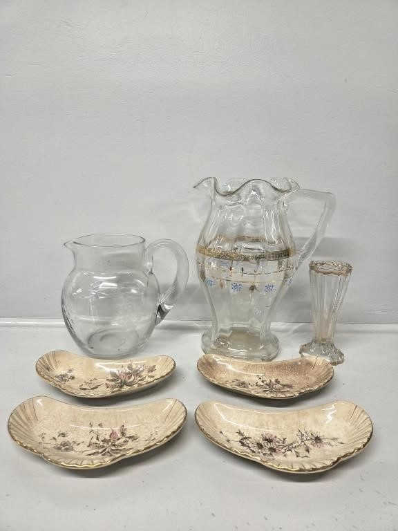
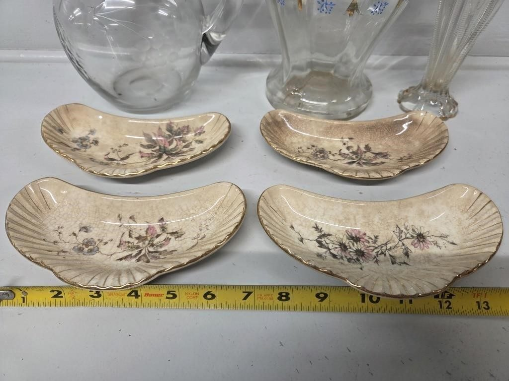
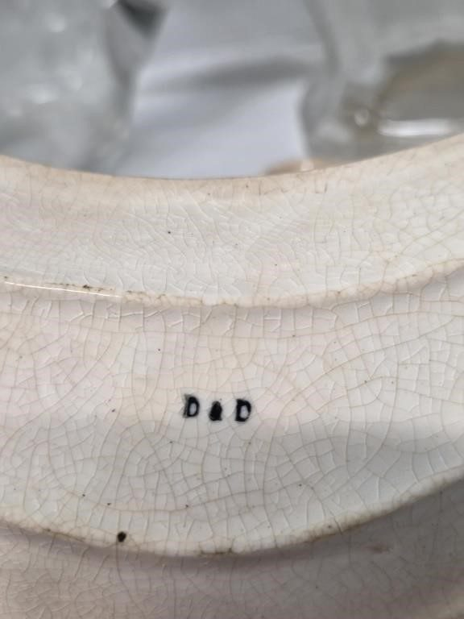
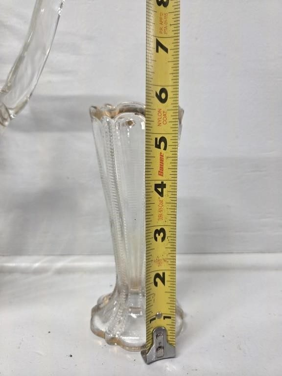
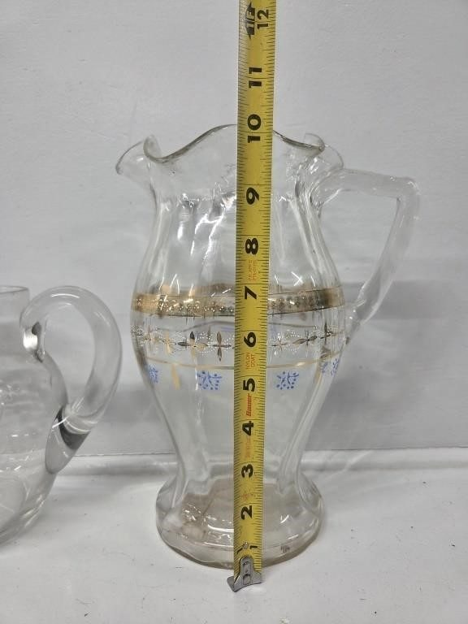
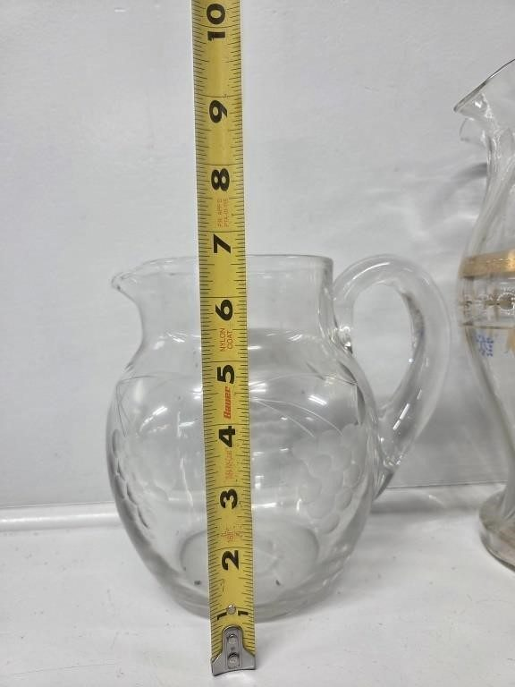

# Lot 733

2 Glass Pitchers, Glass Vase, China Bone Plates(4)

- Snapshot bid: 0.0
- Price realized: 0
- Bid count: 0
- Mirrored photos: 6
- HiBid page: https://hibid.com/lot/321409106

## Photo 1

[Original HiBid image](https://cdn.hibid.com/img.axd?id=8425377766&wid=&rwl=false&p=&ext=&w=0&h=0&t=&lp=&c=true&wt=false&sz=MAX&checksum=RlLFqRbXc5ZuUL66%2fL8j6DytBDVgPkeP)

## Photo 2

[Original HiBid image](https://cdn.hibid.com/img.axd?id=8425377769&wid=&rwl=false&p=&ext=&w=0&h=0&t=&lp=&c=true&wt=false&sz=MAX&checksum=RlLFqRbXc5ZIsLOMM%2bmaUICxnY%2bU55F0)

## Photo 3

[Original HiBid image](https://cdn.hibid.com/img.axd?id=8425377789&wid=&rwl=false&p=&ext=&w=0&h=0&t=&lp=&c=true&wt=false&sz=MAX&checksum=RlLFqRbXc5b1T5Pq8veHfc3F3%2bzunCX3)

## Photo 4

[Original HiBid image](https://cdn.hibid.com/img.axd?id=8425377783&wid=&rwl=false&p=&ext=&w=0&h=0&t=&lp=&c=true&wt=false&sz=MAX&checksum=RlLFqRbXc5ZTvKu1tgKFcucDW60yqmyB)

## Photo 5

[Original HiBid image](https://cdn.hibid.com/img.axd?id=8425377780&wid=&rwl=false&p=&ext=&w=0&h=0&t=&lp=&c=true&wt=false&sz=MAX&checksum=RlLFqRbXc5YUsQjFZ8BBYvK5eDvnMo7i)

## Photo 6

[Original HiBid image](https://cdn.hibid.com/img.axd?id=8425377804&wid=&rwl=false&p=&ext=&w=0&h=0&t=&lp=&c=true&wt=false&sz=MAX&checksum=RptbhFfa136FVWITvmmEoljFCHBPIVqU)
