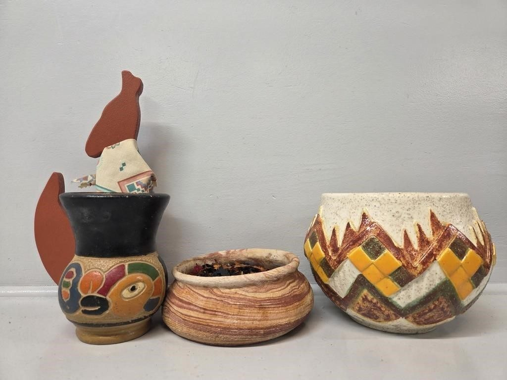
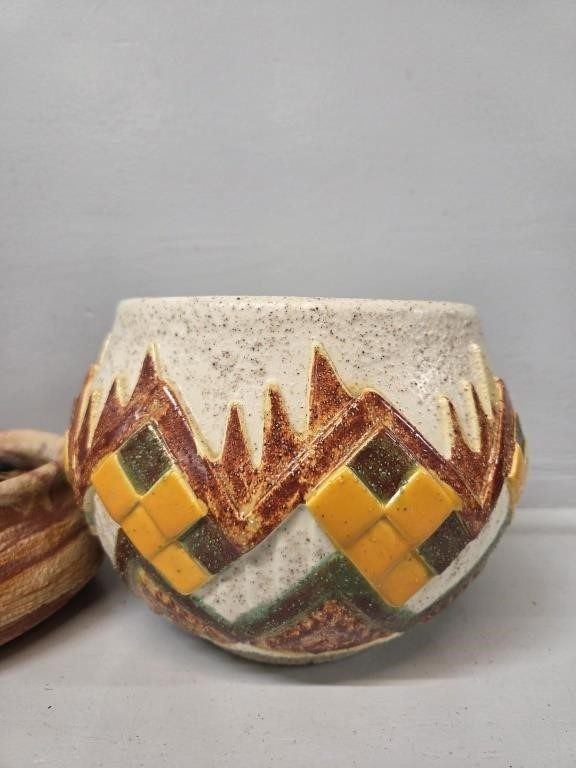
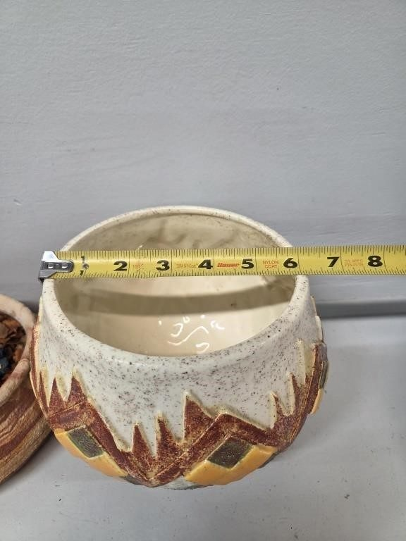
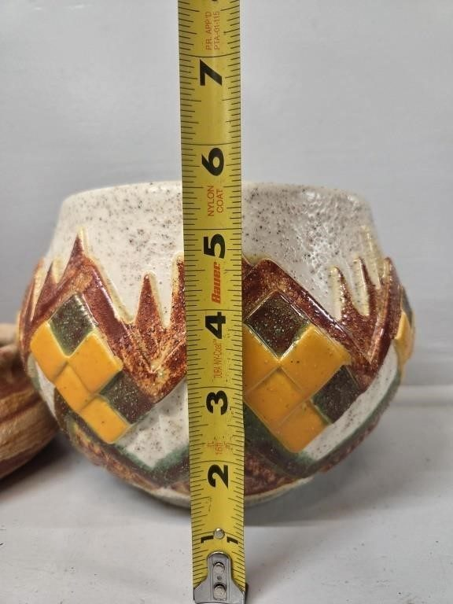
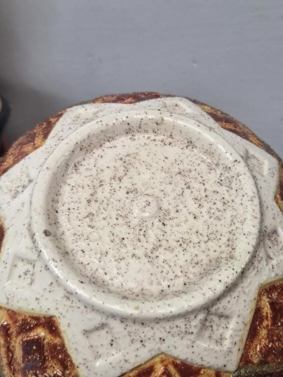
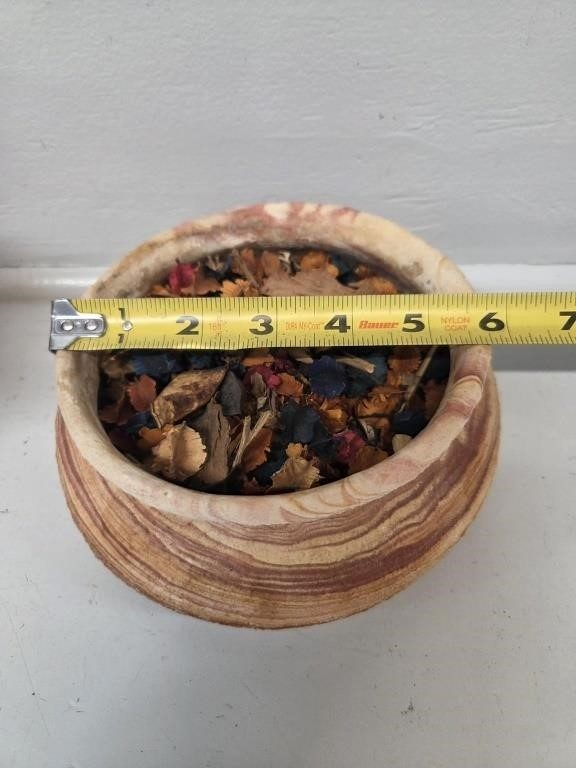
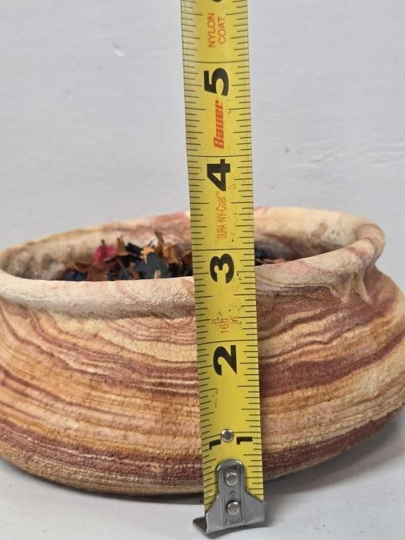
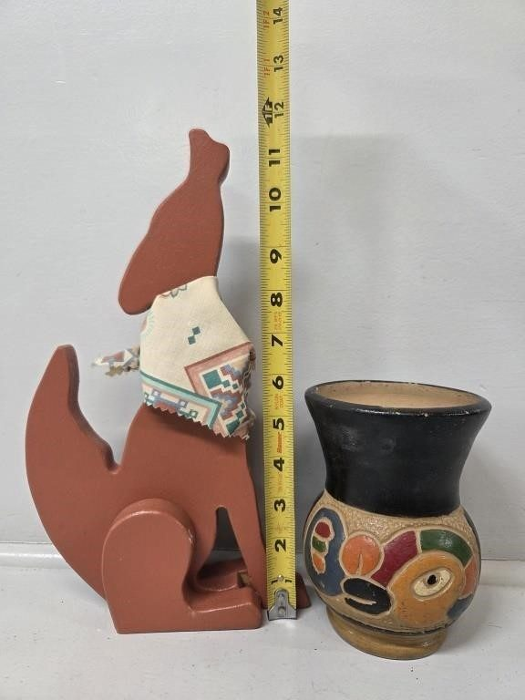

# Lot 748

Aztec Planter, Ceramic Mexican Pottery, Wooden

- Snapshot bid: 3.0
- Price realized: 0
- Bid count: 3
- Mirrored photos: 8
- HiBid page: https://hibid.com/lot/321409121

## Photo 1

[Original HiBid image](https://cdn.hibid.com/img.axd?id=8425378347&wid=&rwl=false&p=&ext=&w=0&h=0&t=&lp=&c=true&wt=false&sz=MAX&checksum=r%2fnLQSNANy5u7qX3IuPcnhYe9yKUMVcR)

## Photo 2

[Original HiBid image](https://cdn.hibid.com/img.axd?id=8425378377&wid=&rwl=false&p=&ext=&w=0&h=0&t=&lp=&c=true&wt=false&sz=MAX&checksum=r%2fnLQSNANy5ItQmtD8%2f6GsWIXU5Z%2b3AJ)

## Photo 3

[Original HiBid image](https://cdn.hibid.com/img.axd?id=8425378358&wid=&rwl=false&p=&ext=&w=0&h=0&t=&lp=&c=true&wt=false&sz=MAX&checksum=r%2fnLQSNANy75ojwLcFPr2fdaayvS6Uuo)

## Photo 4

[Original HiBid image](https://cdn.hibid.com/img.axd?id=8425378346&wid=&rwl=false&p=&ext=&w=0&h=0&t=&lp=&c=true&wt=false&sz=MAX&checksum=r%2fnLQSNANy5%2fecnG9pOHBuHgT6Nmp23m)

## Photo 5

[Original HiBid image](https://cdn.hibid.com/img.axd?id=8425378369&wid=&rwl=false&p=&ext=&w=0&h=0&t=&lp=&c=true&wt=false&sz=MAX&checksum=r%2fnLQSNANy7OtaKi6qZaWGzkCLUlGYqR)

## Photo 6

[Original HiBid image](https://cdn.hibid.com/img.axd?id=8425378396&wid=&rwl=false&p=&ext=&w=0&h=0&t=&lp=&c=true&wt=false&sz=MAX&checksum=r%2fnLQSNANy4EKqOgOJvaLRwQV3aGmheV)

## Photo 7

[Original HiBid image](https://cdn.hibid.com/img.axd?id=8425378393&wid=&rwl=false&p=&ext=&w=0&h=0&t=&lp=&c=true&wt=false&sz=MAX&checksum=r%2fnLQSNANy6C3rMJfUFasDrCF7SGAIVH)

## Photo 8

[Original HiBid image](https://cdn.hibid.com/img.axd?id=8425378389&wid=&rwl=false&p=&ext=&w=0&h=0&t=&lp=&c=true&wt=false&sz=MAX&checksum=r%2fnLQSNANy7kX6Tr5NdHvcB87uyapIb7)
