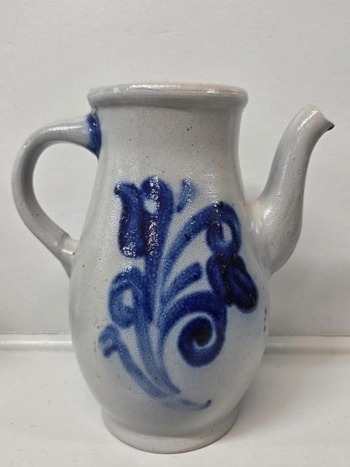
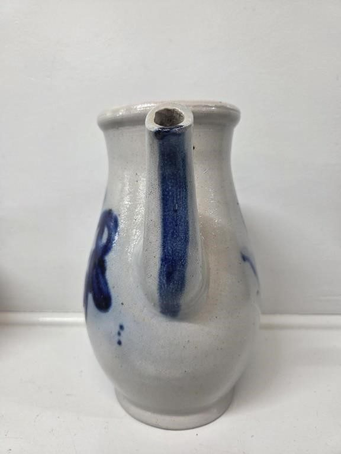
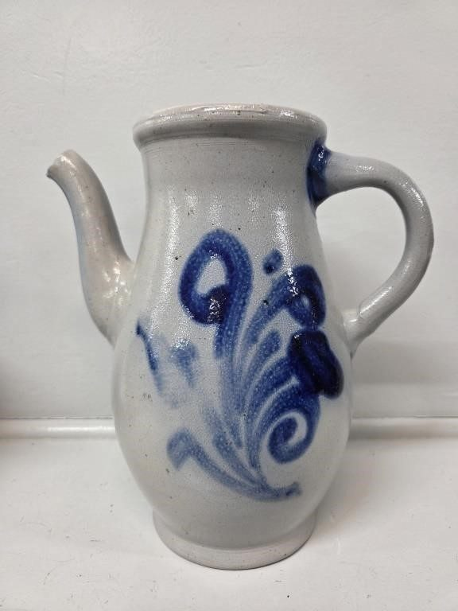
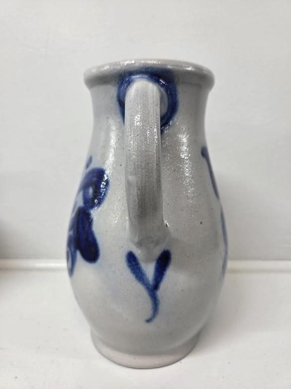
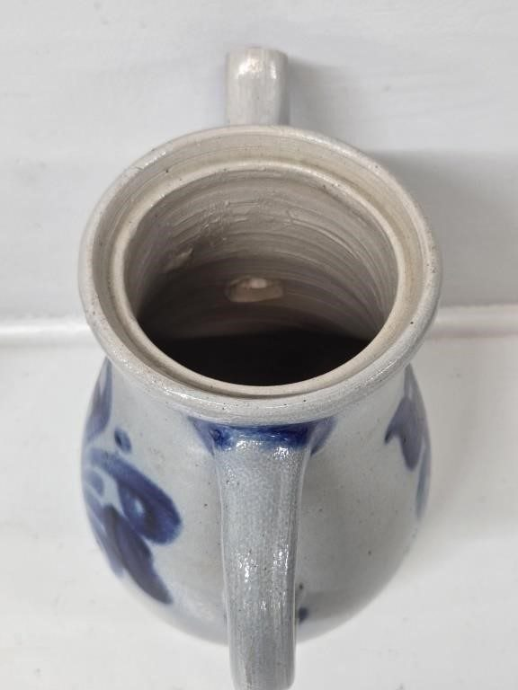
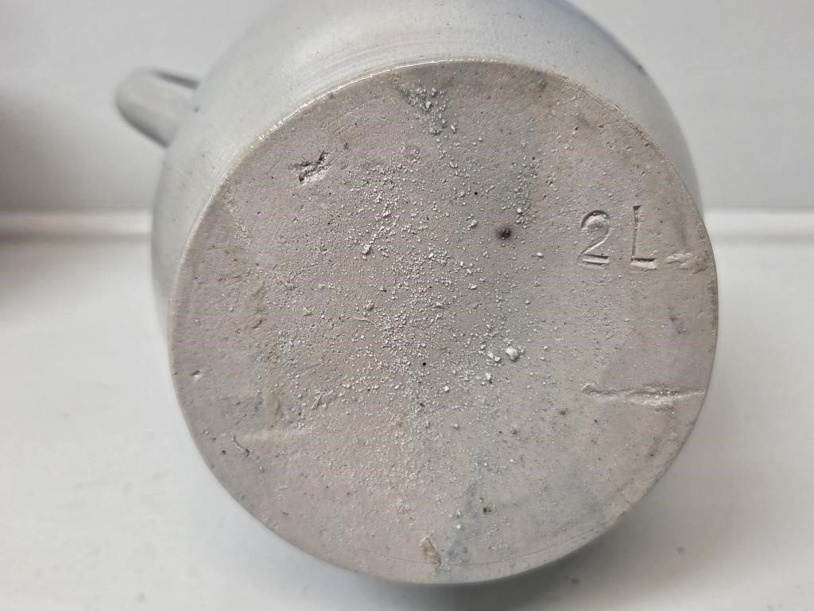
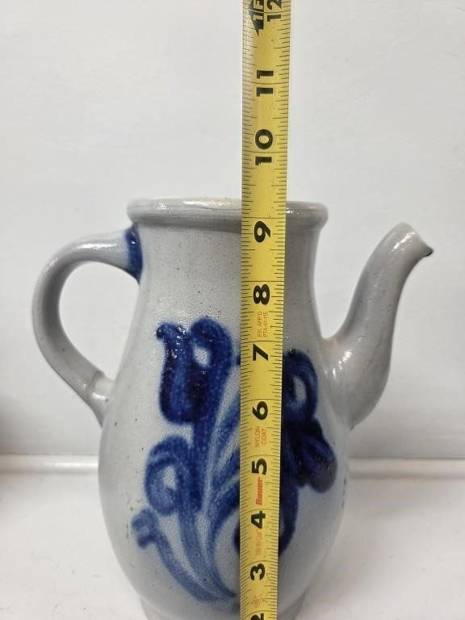
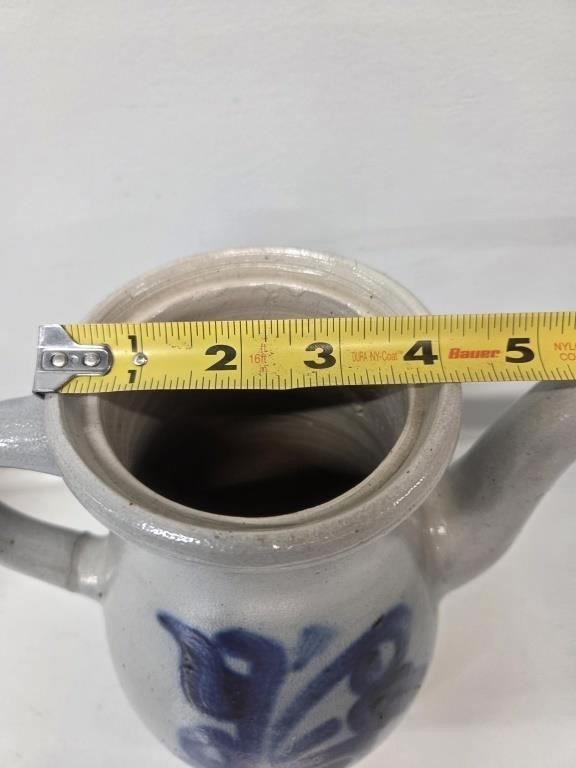

# Lot 752

Cobalt Blue Salt Glazed Pottery Pitcher

- Snapshot bid: 9.0
- Price realized: 0
- Bid count: 7
- Mirrored photos: 8
- HiBid page: https://hibid.com/lot/321409125

## Photo 1

[Original HiBid image](https://cdn.hibid.com/img.axd?id=8425378482&wid=&rwl=false&p=&ext=&w=0&h=0&t=&lp=&c=true&wt=false&sz=MAX&checksum=cQFinnlElmsq70LU0HkAf9819Pp0RyoA)

## Photo 2

[Original HiBid image](https://cdn.hibid.com/img.axd?id=8425378500&wid=&rwl=false&p=&ext=&w=0&h=0&t=&lp=&c=true&wt=false&sz=MAX&checksum=Ke%2b%2bPSLENaRSN1fjly0nCwvQ335aCyJJ)

## Photo 3

[Original HiBid image](https://cdn.hibid.com/img.axd?id=8425378475&wid=&rwl=false&p=&ext=&w=0&h=0&t=&lp=&c=true&wt=false&sz=MAX&checksum=cQFinnlElmt%2fF29m8%2fNgKzJA%2f8hebuPc)

## Photo 4

[Original HiBid image](https://cdn.hibid.com/img.axd?id=8425378487&wid=&rwl=false&p=&ext=&w=0&h=0&t=&lp=&c=true&wt=false&sz=MAX&checksum=cQFinnlElmt%2biKM5%2fXlK9cxITM9wl0HL)

## Photo 5

[Original HiBid image](https://cdn.hibid.com/img.axd?id=8425378514&wid=&rwl=false&p=&ext=&w=0&h=0&t=&lp=&c=true&wt=false&sz=MAX&checksum=Ke%2b%2bPSLENaRhn0XvkO0vy6hGrj7jv9uF)

## Photo 6

[Original HiBid image](https://cdn.hibid.com/img.axd?id=8425378528&wid=&rwl=false&p=&ext=&w=0&h=0&t=&lp=&c=true&wt=false&sz=MAX&checksum=Ke%2b%2bPSLENaTP6RLZsptLJHXU4r2oylKq)

## Photo 7

[Original HiBid image](https://cdn.hibid.com/img.axd?id=8425378551&wid=&rwl=false&p=&ext=&w=0&h=0&t=&lp=&c=true&wt=false&sz=MAX&checksum=Ke%2b%2bPSLENaSuSicONNBI4VEoJC5c98gV)

## Photo 8

[Original HiBid image](https://cdn.hibid.com/img.axd?id=8425378516&wid=&rwl=false&p=&ext=&w=0&h=0&t=&lp=&c=true&wt=false&sz=MAX&checksum=Ke%2b%2bPSLENaTGG%2fBdN7b8KYYNeQbDtaPR)
