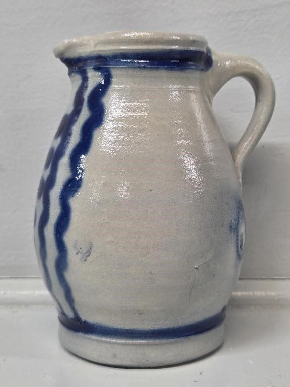
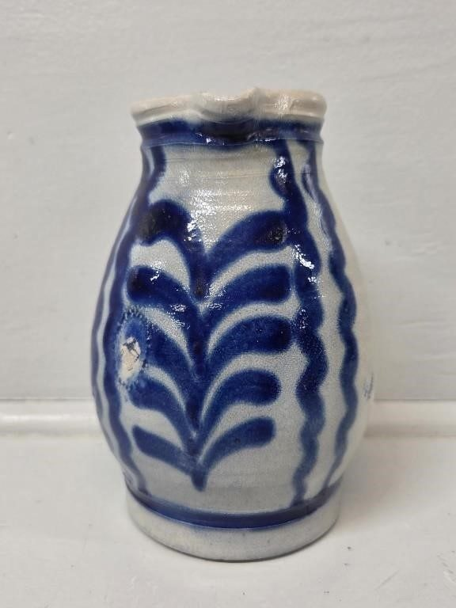
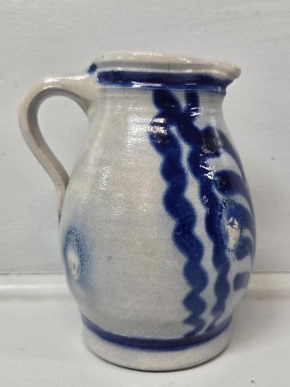
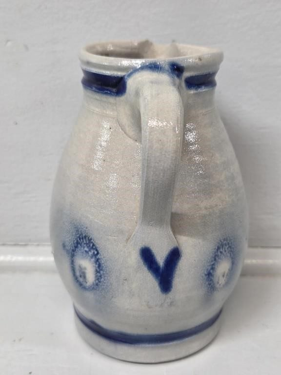
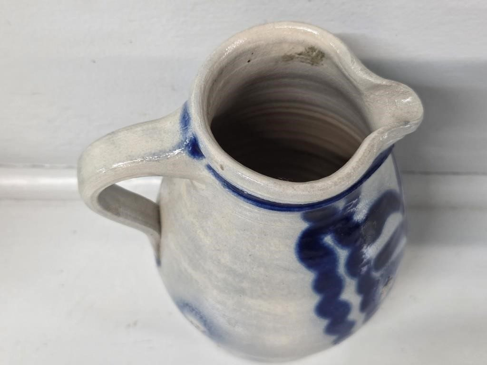
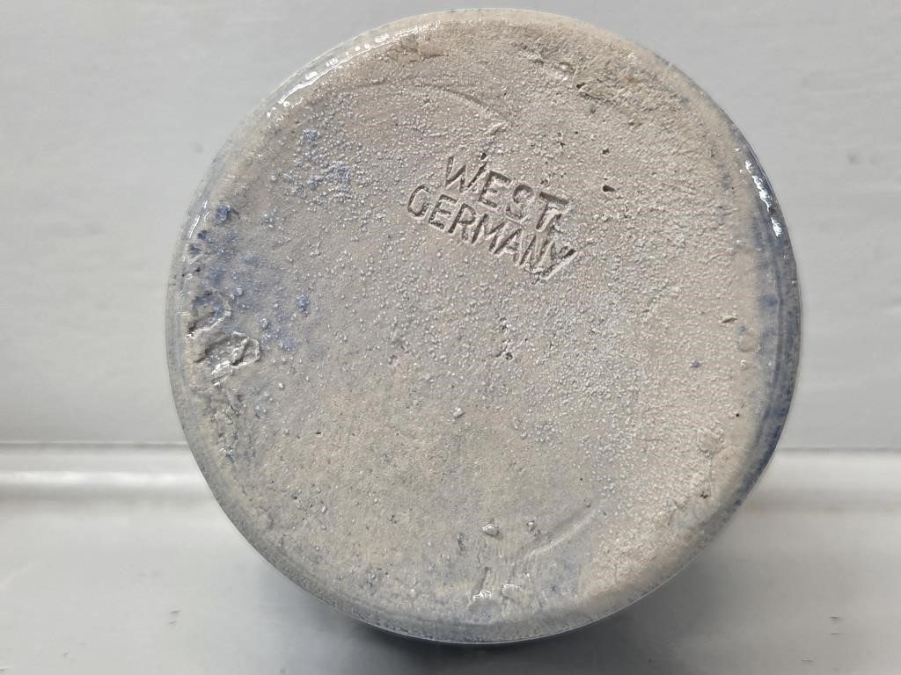
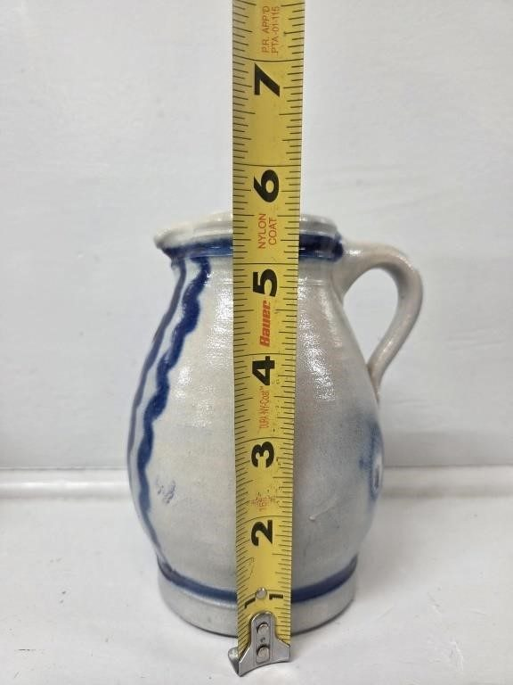
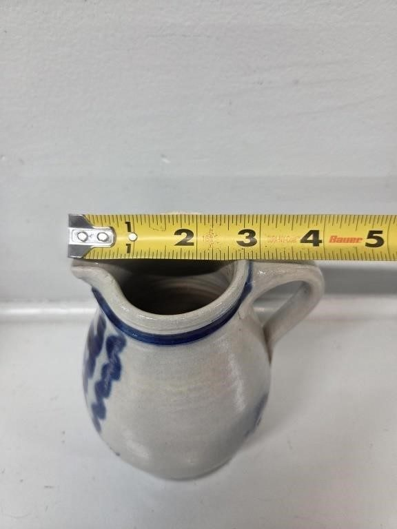

# Lot 752B

Small Cobalt Blue Salt Glazed Pottery Pitcher

- Snapshot bid: 7.0
- Price realized: 0
- Bid count: 7
- Mirrored photos: 8
- HiBid page: https://hibid.com/lot/321409126

## Photo 1

[Original HiBid image](https://cdn.hibid.com/img.axd?id=8425378515&wid=&rwl=false&p=&ext=&w=0&h=0&t=&lp=&c=true&wt=false&sz=MAX&checksum=Ke%2b%2bPSLENaQ9Oy3ZdOKkiedTNfcptqGK)

## Photo 2

[Original HiBid image](https://cdn.hibid.com/img.axd?id=8425378525&wid=&rwl=false&p=&ext=&w=0&h=0&t=&lp=&c=true&wt=false&sz=MAX&checksum=Ke%2b%2bPSLENaRNr0Zz73B3jImix1yr1kMv)

## Photo 3

[Original HiBid image](https://cdn.hibid.com/img.axd?id=8425378513&wid=&rwl=false&p=&ext=&w=0&h=0&t=&lp=&c=true&wt=false&sz=MAX&checksum=Ke%2b%2bPSLENaQroo6N8PTs6El46QbKmvO%2f)

## Photo 4

[Original HiBid image](https://cdn.hibid.com/img.axd?id=8425378535&wid=&rwl=false&p=&ext=&w=0&h=0&t=&lp=&c=true&wt=false&sz=MAX&checksum=Ke%2b%2bPSLENaRdeSS43Ak0fYMLdd3AksN2)

## Photo 5

[Original HiBid image](https://cdn.hibid.com/img.axd?id=8425378562&wid=&rwl=false&p=&ext=&w=0&h=0&t=&lp=&c=true&wt=false&sz=MAX&checksum=Ke%2b%2bPSLENaSSZm9fFjlK3CZMGF7VGsBe)

## Photo 6

[Original HiBid image](https://cdn.hibid.com/img.axd?id=8425378563&wid=&rwl=false&p=&ext=&w=0&h=0&t=&lp=&c=true&wt=false&sz=MAX&checksum=Ke%2b%2bPSLENaReY00yKFhHx4d3lcyezOWk)

## Photo 7

[Original HiBid image](https://cdn.hibid.com/img.axd?id=8425378570&wid=&rwl=false&p=&ext=&w=0&h=0&t=&lp=&c=true&wt=false&sz=MAX&checksum=Ke%2b%2bPSLENaTxEskImiGm4OCzIWkllytl)

## Photo 8

[Original HiBid image](https://cdn.hibid.com/img.axd?id=8425378560&wid=&rwl=false&p=&ext=&w=0&h=0&t=&lp=&c=true&wt=false&sz=MAX&checksum=Ke%2b%2bPSLENaSaBwsV4%2fG9B5TNTkXKkJiJ)
