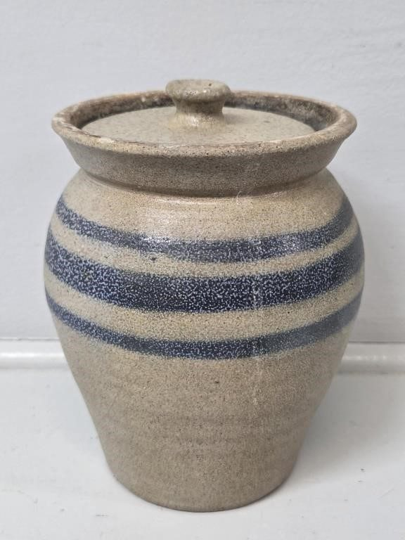
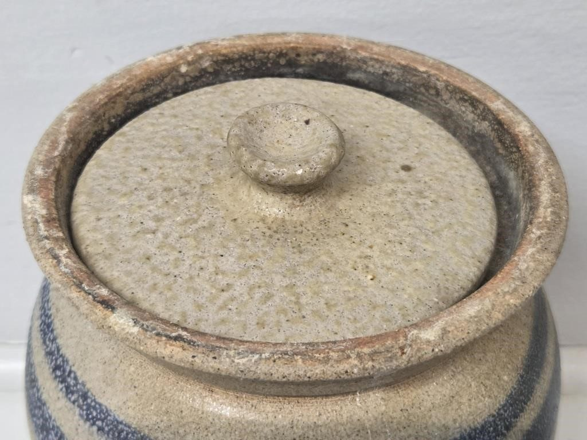
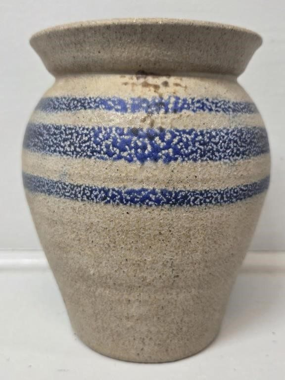
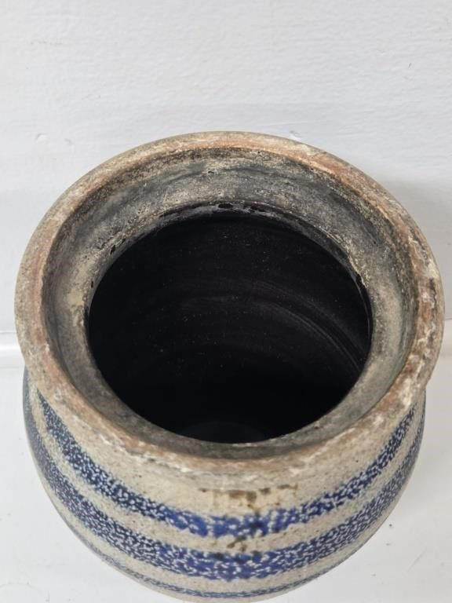
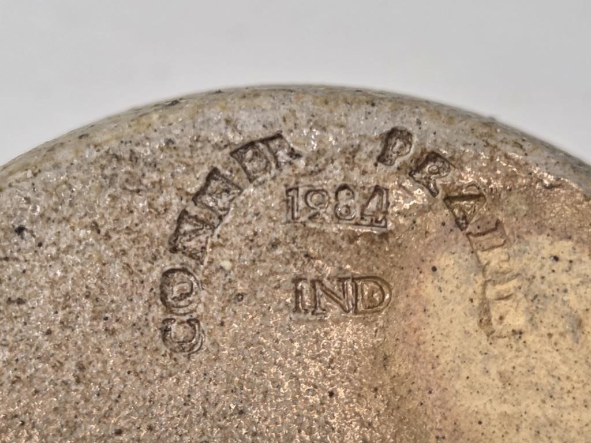
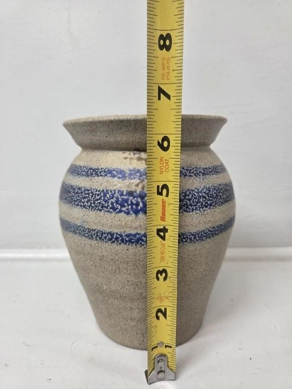
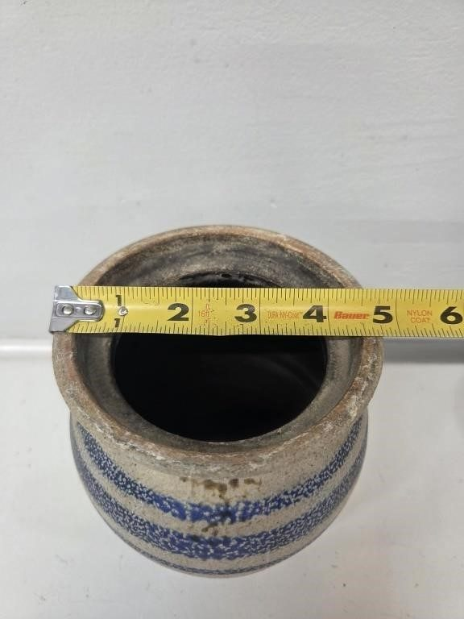

# Lot 752C

Conner Prairie 1984 Primitive Style Crock with Lid

- Snapshot bid: 6.0
- Price realized: 0
- Bid count: 5
- Mirrored photos: 7
- HiBid page: https://hibid.com/lot/321409127

## Photo 1

[Original HiBid image](https://cdn.hibid.com/img.axd?id=8425378573&wid=&rwl=false&p=&ext=&w=0&h=0&t=&lp=&c=true&wt=false&sz=MAX&checksum=Ke%2b%2bPSLENaQxxlN3jwnncAot04gLqlNs)

## Photo 2

[Original HiBid image](https://cdn.hibid.com/img.axd?id=8425378569&wid=&rwl=false&p=&ext=&w=0&h=0&t=&lp=&c=true&wt=false&sz=MAX&checksum=Ke%2b%2bPSLENaSRPpCqdZECk7qQ0VW9bfNP)

## Photo 3

[Original HiBid image](https://cdn.hibid.com/img.axd?id=8425378572&wid=&rwl=false&p=&ext=&w=0&h=0&t=&lp=&c=true&wt=false&sz=MAX&checksum=Ke%2b%2bPSLENaTT5X%2fSkZMsSTOK5mErYqxS)

## Photo 4

[Original HiBid image](https://cdn.hibid.com/img.axd?id=8425378581&wid=&rwl=false&p=&ext=&w=0&h=0&t=&lp=&c=true&wt=false&sz=MAX&checksum=Ke%2b%2bPSLENaS9JL3PbaEqkqez9IprMYjo)

## Photo 5

[Original HiBid image](https://cdn.hibid.com/img.axd?id=8425378576&wid=&rwl=false&p=&ext=&w=0&h=0&t=&lp=&c=true&wt=false&sz=MAX&checksum=Ke%2b%2bPSLENaTNJZz0%2bLJiEdV4EtqbDdoP)

## Photo 6

[Original HiBid image](https://cdn.hibid.com/img.axd?id=8425378578&wid=&rwl=false&p=&ext=&w=0&h=0&t=&lp=&c=true&wt=false&sz=MAX&checksum=Ke%2b%2bPSLENaTZnvnokYNbR1h5aL9Rrkbn)

## Photo 7

[Original HiBid image](https://cdn.hibid.com/img.axd?id=8425378583&wid=&rwl=false&p=&ext=&w=0&h=0&t=&lp=&c=true&wt=false&sz=MAX&checksum=Ke%2b%2bPSLENaQVsAga7Ti3uXQ6j51xl7wt)
