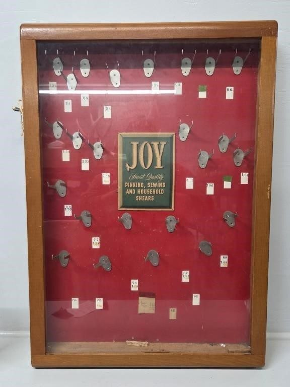
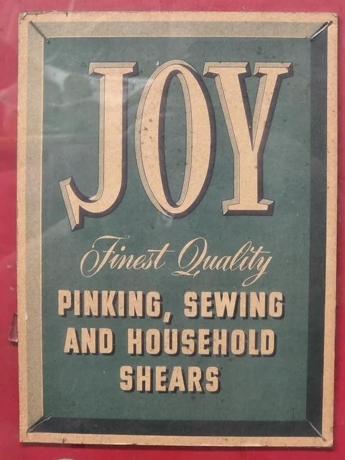
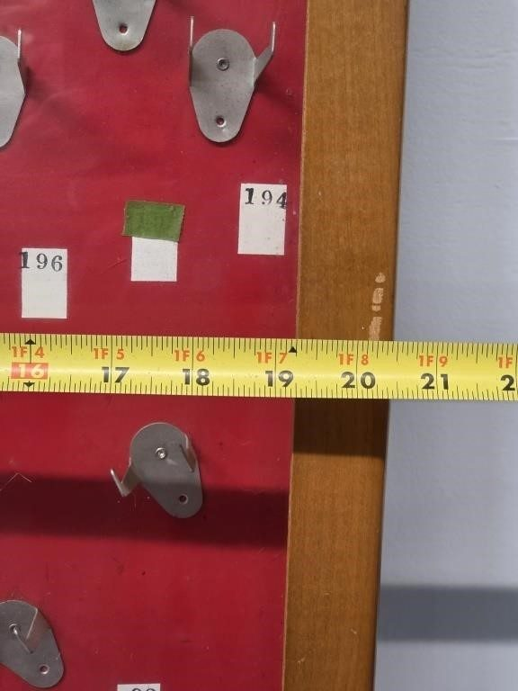
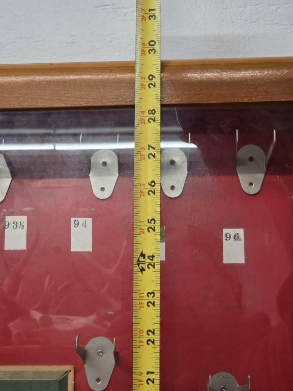
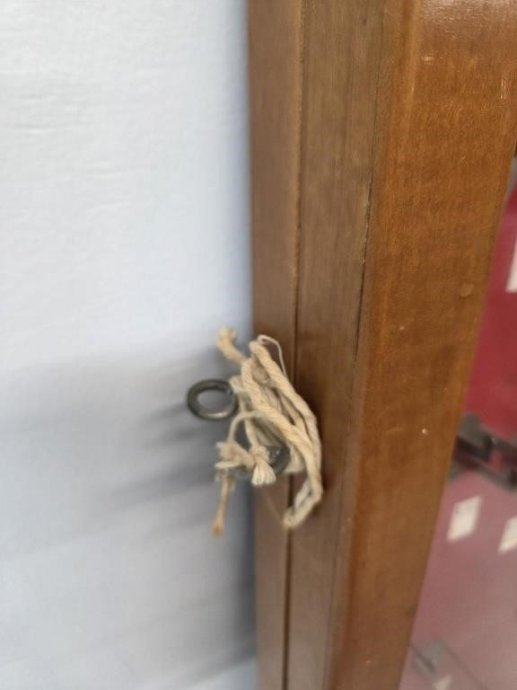

# Lot 772

Cabinet from Gambles Edmore Late 50s Early 60s

- Snapshot bid: 18.0
- Price realized: 0
- Bid count: 11
- Mirrored photos: 5
- HiBid page: https://hibid.com/lot/321409152

## Photo 1

[Original HiBid image](https://cdn.hibid.com/img.axd?id=8425379740&wid=&rwl=false&p=&ext=&w=0&h=0&t=&lp=&c=true&wt=false&sz=MAX&checksum=SAKzOexpGxNBd1mXhfk3SM%2fqC%2bN5k31p)

## Photo 2

[Original HiBid image](https://cdn.hibid.com/img.axd?id=8425379739&wid=&rwl=false&p=&ext=&w=0&h=0&t=&lp=&c=true&wt=false&sz=MAX&checksum=SAKzOexpGxPjAjUwU1GdAQyiXrOf4mki)

## Photo 3

[Original HiBid image](https://cdn.hibid.com/img.axd?id=8425379749&wid=&rwl=false&p=&ext=&w=0&h=0&t=&lp=&c=true&wt=false&sz=MAX&checksum=SAKzOexpGxMe8cUhGBgpNu8%2bvyw7zSyF)

## Photo 4

[Original HiBid image](https://cdn.hibid.com/img.axd?id=8425379748&wid=&rwl=false&p=&ext=&w=0&h=0&t=&lp=&c=true&wt=false&sz=MAX&checksum=SAKzOexpGxNrG50RNFSLGW2dcwnYrfYh)

## Photo 5

[Original HiBid image](https://cdn.hibid.com/img.axd?id=8425379750&wid=&rwl=false&p=&ext=&w=0&h=0&t=&lp=&c=true&wt=false&sz=MAX&checksum=SAKzOexpGxNu%2fDtgT0wTSJPB0ECcUQm%2b)
