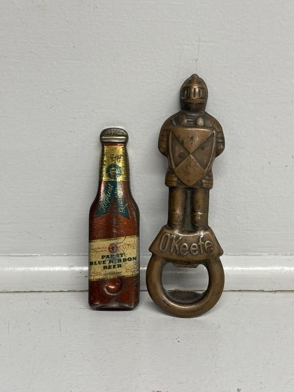
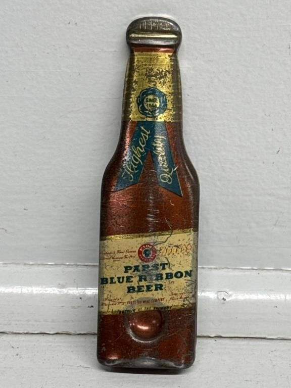
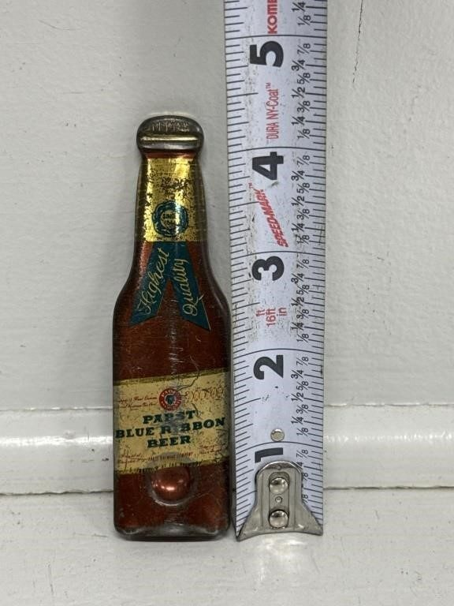
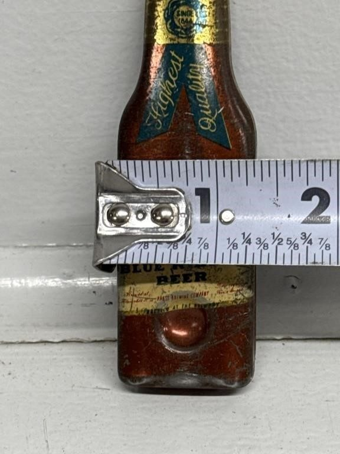
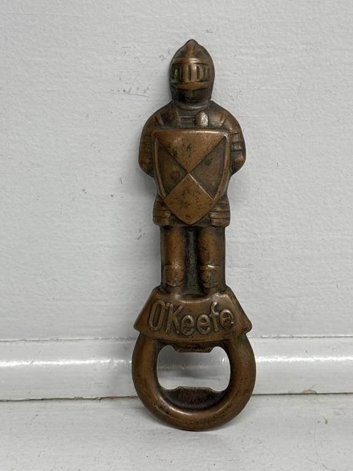
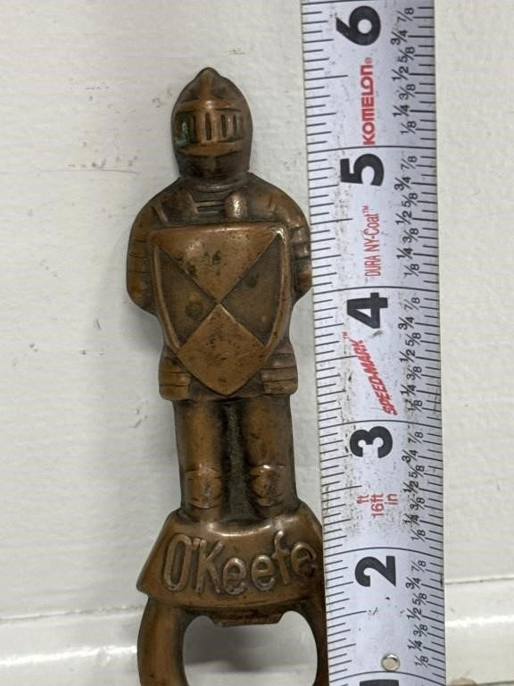
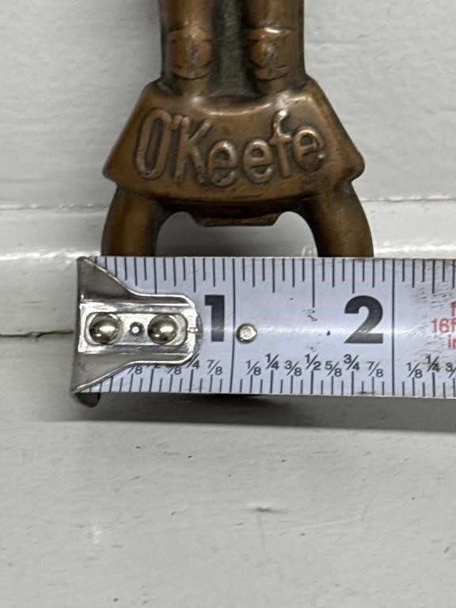

# Lot 895

1940s Pabst Blue Ribbon Bottle Opener,

- Snapshot bid: 4.0
- Price realized: 0
- Bid count: 3
- Mirrored photos: 7
- HiBid page: https://hibid.com/lot/321409292

## Photo 1

[Original HiBid image](https://cdn.hibid.com/img.axd?id=8425386672&wid=&rwl=false&p=&ext=&w=0&h=0&t=&lp=&c=true&wt=false&sz=MAX&checksum=PJ6N6lSruWd0CThADOO0yvJot282Zpwq)

## Photo 2

[Original HiBid image](https://cdn.hibid.com/img.axd?id=8425386331&wid=&rwl=false&p=&ext=&w=0&h=0&t=&lp=&c=true&wt=false&sz=MAX&checksum=uZ0sajID4GXNBtvhn62RXF1szlLZguUf)

## Photo 3

[Original HiBid image](https://cdn.hibid.com/img.axd?id=8425386671&wid=&rwl=false&p=&ext=&w=0&h=0&t=&lp=&c=true&wt=false&sz=MAX&checksum=PJ6N6lSruWf4AeMz4smKi3Xxwy%2bSAS2k)

## Photo 4

[Original HiBid image](https://cdn.hibid.com/img.axd?id=8425386676&wid=&rwl=false&p=&ext=&w=0&h=0&t=&lp=&c=true&wt=false&sz=MAX&checksum=PJ6N6lSruWcpaBZp58lOjZHno7%2bpbajo)

## Photo 5

[Original HiBid image](https://cdn.hibid.com/img.axd?id=8425386698&wid=&rwl=false&p=&ext=&w=0&h=0&t=&lp=&c=true&wt=false&sz=MAX&checksum=PJ6N6lSruWeG3RviBQ%2bFWYHLk9xvjxO8)

## Photo 6

[Original HiBid image](https://cdn.hibid.com/img.axd?id=8425386679&wid=&rwl=false&p=&ext=&w=0&h=0&t=&lp=&c=true&wt=false&sz=MAX&checksum=PJ6N6lSruWdFoqgOalANSgflE9vtCERn)

## Photo 7

[Original HiBid image](https://cdn.hibid.com/img.axd?id=8425386326&wid=&rwl=false&p=&ext=&w=0&h=0&t=&lp=&c=true&wt=false&sz=MAX&checksum=uZ0sajID4GVD0CcXQXKSiEglW%2be8%2fDkQ)
