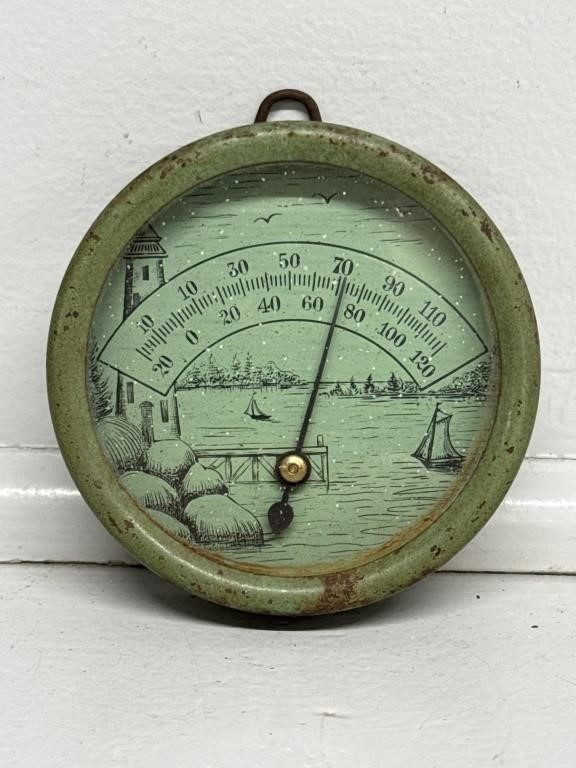
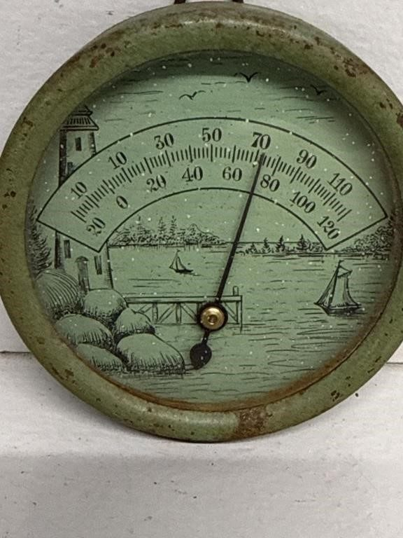
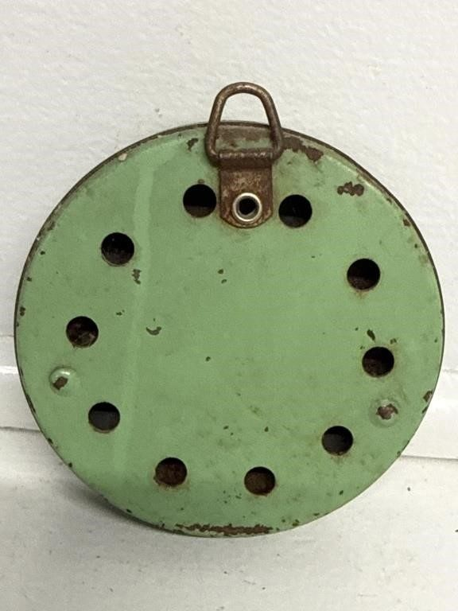
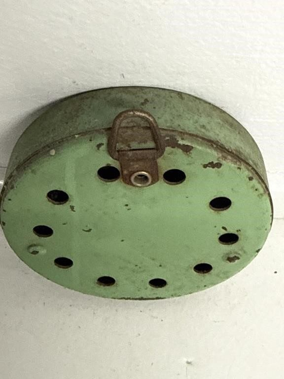
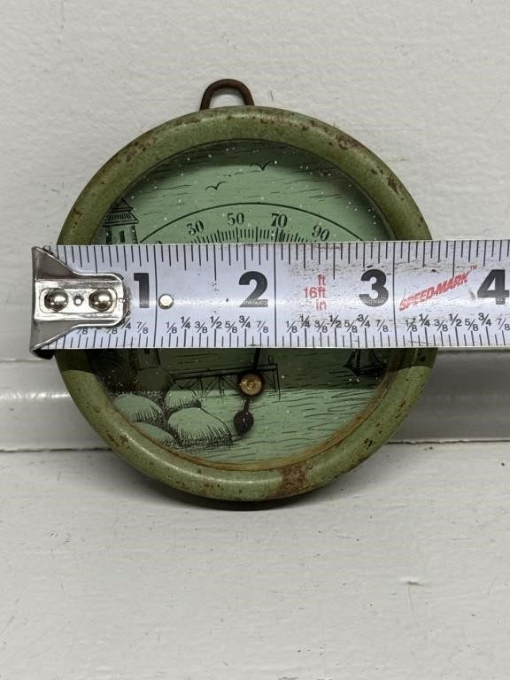
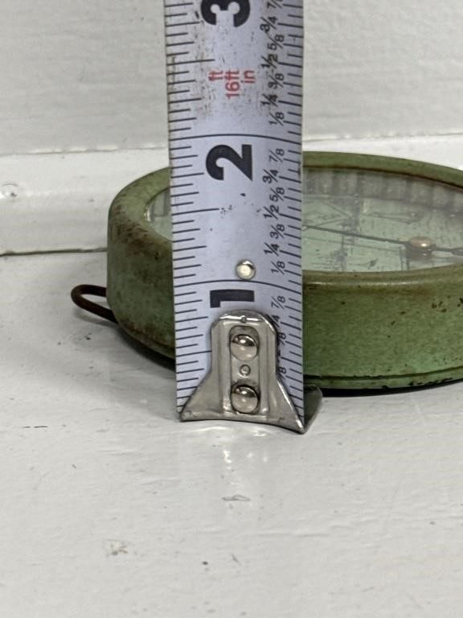

# Lot 898

Thermometer from 1933 Chicago World's Fair

- Snapshot bid: 8.0
- Price realized: 0
- Bid count: 7
- Mirrored photos: 6
- HiBid page: https://hibid.com/lot/321409295

## Photo 1

[Original HiBid image](https://cdn.hibid.com/img.axd?id=8425386699&wid=&rwl=false&p=&ext=&w=0&h=0&t=&lp=&c=true&wt=false&sz=MAX&checksum=PJ6N6lSruWfhQthK%2bkyUl8TE%2bo3v%2byWC)

## Photo 2

[Original HiBid image](https://cdn.hibid.com/img.axd?id=8425386503&wid=&rwl=false&p=&ext=&w=0&h=0&t=&lp=&c=true&wt=false&sz=MAX&checksum=rRkqMZJgkuPH70KzNPk6W9G%2bIyS%2bBMk6)

## Photo 3

[Original HiBid image](https://cdn.hibid.com/img.axd?id=8425386491&wid=&rwl=false&p=&ext=&w=0&h=0&t=&lp=&c=true&wt=false&sz=MAX&checksum=D8ULd6t%2fL8wKp44cgZCu36s5KVS8mwxO)

## Photo 4

[Original HiBid image](https://cdn.hibid.com/img.axd?id=8425386694&wid=&rwl=false&p=&ext=&w=0&h=0&t=&lp=&c=true&wt=false&sz=MAX&checksum=PJ6N6lSruWdK6xGE3HkSUm3N%2f5iFaM6W)

## Photo 5

[Original HiBid image](https://cdn.hibid.com/img.axd?id=8425386487&wid=&rwl=false&p=&ext=&w=0&h=0&t=&lp=&c=true&wt=false&sz=MAX&checksum=D8ULd6t%2fL8xmnxYA%2fn%2b0dvBww2043h%2fI)

## Photo 6

[Original HiBid image](https://cdn.hibid.com/img.axd?id=8425386770&wid=&rwl=false&p=&ext=&w=0&h=0&t=&lp=&c=true&wt=false&sz=MAX&checksum=YPt%2f1%2fGUMD7TW67SLZC0HQlPrBN4GnZ2)
