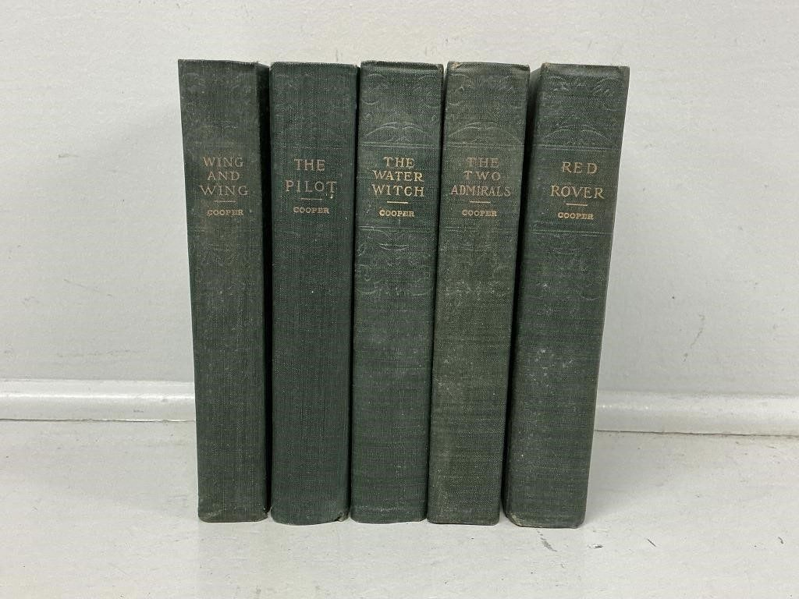
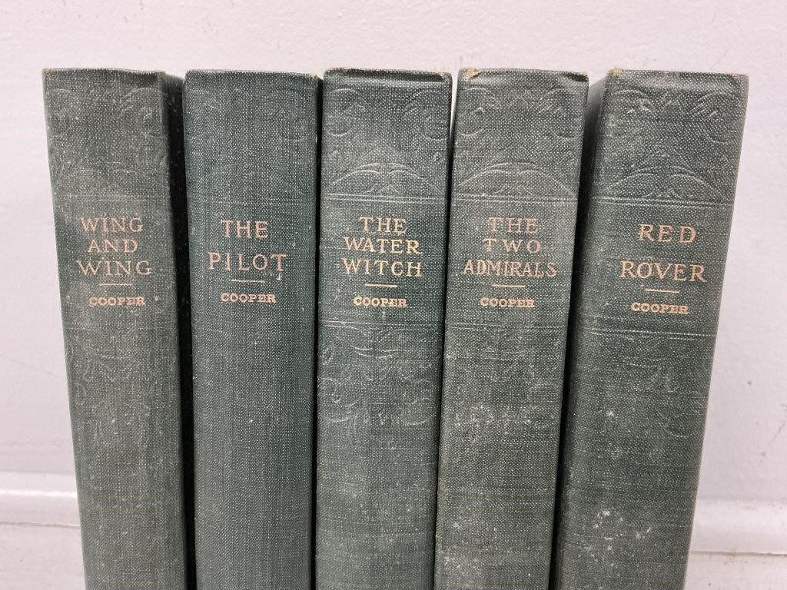
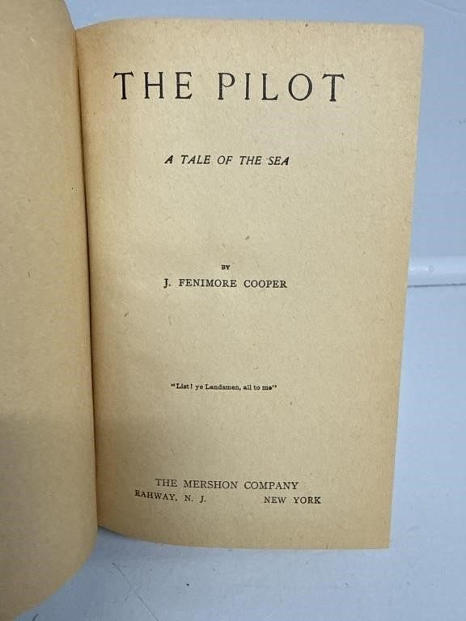
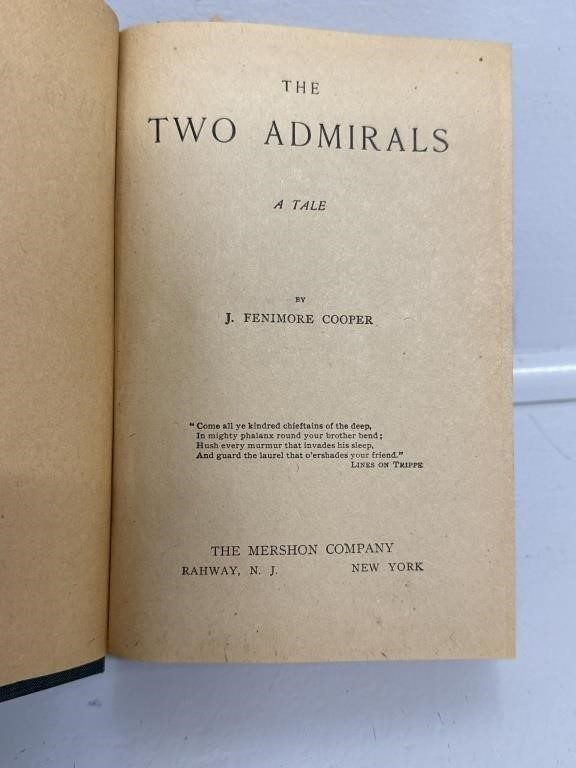

# Lot 937

Tales by J. Fenmore Cooper All Published 1930’s

- Snapshot bid: 4.0
- Price realized: 0
- Bid count: 3
- Mirrored photos: 4
- HiBid page: https://hibid.com/lot/321409334

## Photo 1

[Original HiBid image](https://cdn.hibid.com/img.axd?id=8425388166&wid=&rwl=false&p=&ext=&w=0&h=0&t=&lp=&c=true&wt=false&sz=MAX&checksum=DFSH2PhqdYjxyJe9Vl9mLSKd3Ty6LH57)

## Photo 2

[Original HiBid image](https://cdn.hibid.com/img.axd?id=8425388157&wid=&rwl=false&p=&ext=&w=0&h=0&t=&lp=&c=true&wt=false&sz=MAX&checksum=DFSH2PhqdYh7eAxfU%2fX4CvUD0qNBQqAp)

## Photo 3

[Original HiBid image](https://cdn.hibid.com/img.axd?id=8425388156&wid=&rwl=false&p=&ext=&w=0&h=0&t=&lp=&c=true&wt=false&sz=MAX&checksum=DFSH2PhqdYjZsub9aBStBhS0RLplBvrK)

## Photo 4

[Original HiBid image](https://cdn.hibid.com/img.axd?id=8425388152&wid=&rwl=false&p=&ext=&w=0&h=0&t=&lp=&c=true&wt=false&sz=MAX&checksum=DFSH2PhqdYg3fCwqJVgxO%2bygLG6WL3ff)
